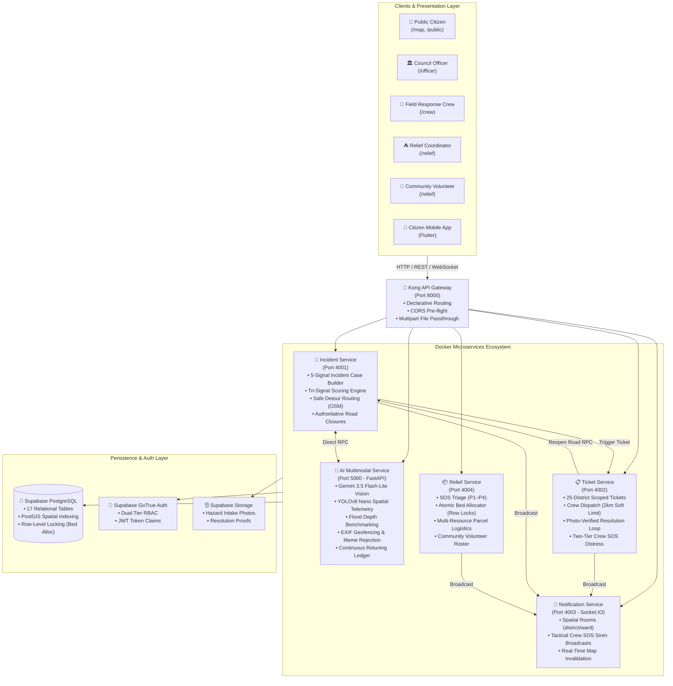

# Civic Guard — Disaster Response Intelligence & Nationwide Coordination Platform

> **CodeArena '26 Ideathon · Topic 04: Disaster Response**  
> An end-to-end municipal and citizen disaster intelligence & emergency operations platform. Features **5-signal hybrid multimodal hazard verification** (Google Gemini 3.5 Flash-Lite + YOLOv8 Nano), authoritative road closures, real-time dynamic evacuation routing, a **25-district hierarchical field crew command** (250 tactical squads nationwide), **atomic concurrency-safe shelter bed allocation**, and a **closed-loop photo-verified resolution pipeline** guaranteeing closed roads are never reopened without verified ground proof.

[](#-automated-verification--test-suites)
[-blue?style=flat-square)](#3--25-district-nationwide-command-hierarchy--250-field-response-crews-adr-031)
[](#1-️-5-signal-hybrid-verification-engine-with-gemini-35-flash-lite--yolov8)
[](#-system-architecture)
[](#-system-architecture)
[](#-ideathon-information)

---

## 📑 Table of Contents
- [🌟 Executive Summary](#-executive-summary)
- [🏛️ System Architecture](#-system-architecture)
- [⚡ Key Core Features](#-key-core-features)
  - [1. 5-Signal Hybrid Multimodal Verification Engine](#1-️-5-signal-hybrid-verification-engine-with-gemini-35-flash-lite--yolov8)
  - [2. Authoritative Road Closures & Safe Detour Corridors](#2--authoritative-road-closures--safe-detour-corridors)
  - [3. 25-District Command Hierarchy & 250 Field Crews](#3--25-district-nationwide-command-hierarchy--250-field-response-crews-adr-031)
  - [4. Relief Logistics Desk & Community Volunteer Network](#4--relief-logistics-desk-atomic-bed-allocation--volunteer-network)
  - [5. Dual-Tier Authentication & Role Navigation Isolation](#5--dual-tier-authentication-role-based-sign-in--navigation-isolation)
  - [6. Cross-Platform Citizen Mobile App](#6--cross-platform-citizen-mobile-app)
  - [7. Phase 4 Integration Test Suite](#7--phase-4-integration-test-suite--docker-orchestration)
- [🖥️ Operational Workspaces & Portals](#-operational-workspaces--portals)
- [👥 Demo Personas & Credentials](#-demo-personas--credentials)
- [🚦 Network & Port Reference](#-network--port-reference)
- [🚀 Quick Start Guide](#-quick-start-guide)
- [🧪 Automated Verification & Test Harness](#-automated-verification--test-suites)
- [📁 Repository Directory Structure](#-repository-directory-structure)
- [📚 Architecture Decision Records (ADRs)](#-architecture-decision-records-adrs)
- [🏆 Ideathon Information](#-ideathon-information)

---

## 🌟 Executive Summary

During severe monsoons, tropical depressions, and flash floods, urban and rural infrastructure across Sri Lanka degrades rapidly: major river basins (Kelani, Kalu, Gin, Nilwala) swell past critical thresholds, drainage systems back up, arterial roadways submerge under bumper-level water, and fallen trees sever transportation corridors faster than municipal councils can physically inspect.

While citizens post fragmented alerts and urgent rescue pleas across social media, municipal disaster management authorities face three systemic bottlenecks:
1. **Information Overload & Misinformation**: Unverified photos, recycled viral media from past years, and internet memes overwhelm emergency dispatch queues.
2. **Delayed Hazard Detection**: Manual hotlines and physical drive-by inspections cannot keep pace with flash-flood surge velocities.
3. **Disconnected Response Silos**: Municipal engineers, field squads, relief shelter managers, and vulnerable citizens operate without a synchronized operational picture, leading to blocked evacuation corridors, misallocated relief supplies, and premature road reopenings that endanger motorists.

**Civic Guard** solves this through an end-to-end **closed-loop disaster intelligence platform**. It pairs deterministic geospatial and hydrological telemetry with **Google Gemini 3.5 Flash-Lite multimodal reasoning** and **YOLOv8 nano computer vision** to verify hazards in real time, enforce authoritative road closures, calculate dynamic detour routes, dispatch specialized field squads across all 25 Sri Lankan districts, manage emergency shelter capacities atomically, and guarantee that closed roads cannot be reopened without verified photo proof.

---

## 🏛️ System Architecture

Civic Guard is architected as an event-driven microservices ecosystem orchestrated via Docker Compose, secured through Kong API Gateway on port `8000`, and backed by Supabase PostgreSQL with PostGIS spatial indexing:



---

## ⚡ Key Core Features

### 1. 🛡️ 5-Signal Hybrid Verification Engine with Gemini 3.5 Flash-Lite & YOLOv8
Incoming citizen hazard reports undergo a 5-signal multi-tier verification pipeline (`incident-service` + `ai-service`) combining deterministic environmental data with multimodal AI intelligence:
- **Signal 1: Spatio-Temporal Clustering**: Aggregates nearby citizen reports within a 200-meter radius and 3-hour rolling window using indexed bounding-box spatial queries (`ST_DWithin`).
- **Signal 2: Hydrological & Weather Telemetry Correlation**: Correlates reported flood depths against live precipitation gauges (e.g., rainfall rate mm/h) and river basin water levels (e.g., Kelani / Kalu river crest heights).
- **Signal 3: Gemini 3.5 Flash-Lite Multimodal Analysis & YOLOv8 Spatial Telemetry (ADR-029, ADR-031)**:
  - **Gemini 3.5 Flash-Lite** acts as the primary multimodal judge under a strict 1.5s SLA. It outputs validated Pydantic JSON evaluating scene authenticity, hazard classification, and flood depth benchmarks (`SURFACE_PUDDLE`, `TIRE_LEVEL`, `BUMPER_LEVEL`, `SUBMERGED_VEHICLES`).
  - Concurrent **YOLOv8 Nano** runs background spatial object detection, tracking vehicles, pedestrians, and physical road blockages for tactical overlays.
- **Signal 4: EXIF GPS & Scene Authenticity Validator**:
  - Extracts hardware EXIF metadata and calculates Haversine distance against Sri Lanka territorial boundaries (`5.9°N–9.9°N, 79.5°E–82.0°E`).
  - Evaluates image entropy and visual patterns to reject flat-background memes, cartoons, screenshots, or indoor photos (assigning a low spam score $<0.30$).
- **Signal 5: Multi-Criteria Risk Urgency Engine**: Computes dynamic risk urgency (P1 Critical through P4 Low) factoring road hierarchy (arterial vs. local), proximity to critical infrastructure (hospitals, schools, fire stations), and flood rise velocity.
- **Tri-Signal Re-Weighted Scoring Formula (ADR-030)**: Reports reaching $\ge 75\%$ aggregate confidence are automatically confirmed for immediate officer dispatch.
- **Continuous Feedback Ledger (Stage 6)**: Records officer confirmations, dismissals, and false-positive overrides in `data/feedback_records.jsonl` for continuous model calibration.
- **Classical Heuristic Fallback**: Includes automated computer vision fallback (colorimetry, edge density, water surface texture) guaranteeing operational continuity even if external AI APIs are unreachable.

### 2. ⛔ Authoritative Road Closures & Safe Detour Corridors
- When high-severity flood or blockage hazards are confirmed, Council Officers trigger **Authoritative Road Closures** with one click.
- The **Safe Route Planner** (`/api/incidents/routes/safe-path`) dynamically re-routes commuters, citizens, and emergency response vehicles around active road closures, snapping to OpenStreetMap centerlines and high-capacity bypass corridors (e.g., Baseline Road, Galle Road, High Level Road).
- Road closures immediately broadcast red barrier overlays (`⛔ CLOSED`) and trigger reactive map re-centering across all connected web and mobile clients via Socket.IO.

### 3. 🚒 25-District Nationwide Command Hierarchy & 250 Field Response Crews (ADR-031)
Civic Guard scales municipal disaster management across **all 25 administrative districts** of Sri Lanka:
- **Hierarchical Command**: 25 District Officers overseeing **10 specialized tactical squads each**, delivering **250 response units nationwide**.
- **Specialty Tracks**:
  - `WATER_RESCUE` (Inflatable boats, swift-water extraction, life preservers)
  - `4X4_DEBRIS` (Heavy winches, chainsaws, obstacle clearing, tree removal)
  - `MEDICAL_TRIAGE` (Paramedic kits, emergency trauma stabilization, mobile oxygen)
  - `DRONE_RECON` (Thermal imaging, aerial flood mapping, line-of-sight reconnaissance)
  - `HAM_RADIO` (High-frequency auxiliary disaster communications during cell tower failure)
- **Smart Dispatch Rules**: Enforces a soft 2km proximity threshold with mandatory officer justification for emergency overrides.
- **Two-Tier SOS Distress Pinpoint**: Field crews facing life-threatening conditions trigger an emergency SOS beacon (`crew:sos`), immediately sounding pulsating audio sirens and flashing high-visibility red banners on the Officer Tactical Command Center.
- **Photo-Verified Closed-Loop Resolution (ADR-005)**: To eliminate catastrophic premature road reopenings, dispatch tickets **cannot be closed** without an on-site photo proof, field SitRep notes, and civilian headcount. Submitting verified resolution proof automatically reopens the road and removes the hazard from the public map.

### 4. ⛺ Relief Logistics Desk, Atomic Bed Allocation & Volunteer Network
- **P1–P4 SOS Distress Triage**: Stranded citizens submit SOS assistance requests categorized by urgency and special needs (medical emergencies, elderly care, infant nutrition, search & rescue).
- **Atomic Conditional Bed Allocation (ADR-011)**: Uses PostgreSQL transactions with row-level locking (`SELECT ... FOR UPDATE`) to eliminate race-condition overbooking during mass evacuation spikes.
- **Multi-Resource Parcel Allocation**: Tracks and dispatches emergency food rations, clean drinking water, first aid supplies, blankets, and sanitary packs to designated relief centers.
- **Community Volunteer Roster (ADR-028, ADR-029)**: Structurally separates official response squads from registered community volunteers. Sourcing missions from confirmed `hazard_verdicts`, volunteers check in to support shelter logistics, food distribution, and non-hazardous neighborhood aid.

### 5. 🔒 Dual-Tier Authentication, Role-Based Sign-In & Navigation Isolation
- **100% Open Public Access (ADR-025)**: Citizens freely view the Public Hazard Map (`/map`, `/public`), plan detour routes, and report hazards with zero login barriers.
- **Role-Gated Operations Portals**: Municipal officers, field squads, and relief staff access restricted portals (`/officer`, `/crew`, `/relief`) protected by `<ProtectedRoute>` guards, Supabase GoTrue authentication, and decoded JWT claims.
- **Single-Role Navigation Isolation (ADR-035)**: Top navigation header eliminates cross-role tab clutter. Authenticated users see only their active workspace, while the homepage features 1-click persona quick-select cards for instantaneous evaluation.

### 6. 📱 Cross-Platform Citizen Mobile App
- Complementary Flutter mobile client providing field-tested disaster reporting, camera-integrated hazard capture, offline SQLite queueing for cellular blackouts, and real-time safe route navigation.

### 7. 🧪 Phase 4 Integration Test Suite & Docker Orchestration
- **Native Container Healthchecks**: All 7 containers in `docker-compose.yml` declare strict native healthchecks with `condition: service_healthy` startup orchestration.
- **Automated Verification Harness**: Master test runner executing 22 integration tests across Kong Gateway routing, multi-ward storm bursts, and full closed-loop incident lifecycles.

---

## 🖥️ Operational Workspaces & Portals

The frontend web application (`web/`) is built with React 18, Vite, TypeScript, Tailwind CSS, and Leaflet, adhering to a high-contrast **Pure Light Mode** design system (ADR-022) with map stacking context isolation (ADR-027, ADR-034):

| Portal | URL Route | Target Audience | Primary Capabilities |
| :--- | :--- | :--- | :--- |
| **Public Hazard & Safe Route Map** | `/map` or `/public` | Citizens, Commuters, Donors | • Live hazard pins with severity badges<br>• Closed road red barrier indicators (`⛔ CLOSED`)<br>• Dynamic safe detour corridor planner avoiding closed segments<br>• Emergency shelter pins with live bed availability gauges<br>• Citizen hazard report modal with photo upload, GPS pin-drop & Gemini AI check |
| **Council Officer Control Center** | `/officer` | District Officers, Municipal Engineers | • 25-district command switcher with localized metrics<br>• Ward-by-ward real-time hazard triage grid<br>• 5-Signal Incident Command Inspector with Gemini 3.5 Flash-Lite forensic reasoning & YOLOv8 overlays<br>• 10-squad tactical crew roster (`DistrictCrewRoster.tsx`) with proximity dispatch<br>• One-click authoritative road closure manager<br>• Real-time crew SOS distress siren interception |
| **Field Crew Tactical Desk** | `/crew` | Emergency Squad Leads | • Mobile-first tactical dispatch tickets with situational context<br>• Turn-by-turn navigation map avoiding closed road segments<br>• Live GPS beacon broadcaster & two-tier emergency SOS button<br>• Photo-verified completion modal requiring on-site imagery & SitRep notes |
| **Relief Logistics Desk** | `/relief` | Relief Coordinators, Red Cross | • Priority P1–P4 SOS distress triage queue with special needs indicators<br>• Interactive shelter network map with live circular bed gauges<br>• 1-click nearest shelter matcher with atomic reservation<br>• Multi-resource emergency parcel allocation modal<br>• Community Volunteer Roster desk with mission check-in |
| **Role-Based Authentication Gateway** | `/login` | Municipal & Relief Personnel | • Tabbed gateway with 1-click demo persona quick-select<br>• Supabase GoTrue email/password authentication & session caching<br>• Open citizen access shortcuts |

---

## 👥 Demo Personas & Credentials

For evaluation, testing, and demonstrations, the platform provides pre-configured municipal personas with 1-click login buttons on both the homepage and `/login`:

| Role | Operational Persona | Email | Password | District / Tactical Assignment |
| :--- | :--- | :--- | :--- | :--- |
| **Council Officer** | Kasun Perera | `kasun.officer@cmc.gov.lk` | `Officer@123` | Colombo District Command (10 Squads) |
| **Council Officer** | Officer Kandy | `officer.kandy@civicguard.gov.lk` | `Officer@123` | Central Province Command (10 Squads) |
| **Council Officer** | Officer Galle | `officer.galle@civicguard.gov.lk` | `Officer@123` | Southern Coastal Command (10 Squads) |
| **Council Officer** | Officer Ratnapura | `officer.ratnapura@civicguard.gov.lk` | `Officer@123` | Sabaragamuwa Command (10 Squads) |
| **Field Squad Lead** | Sunil Shantha | `sunil.water@cmc.gov.lk` | `Crew@123` | Water Rescue Squad 01 (Colombo) |
| **Field Squad Lead** | Bandara Senanayake | `bandara.4x4@civicguard.lk` | `Crew@123` | 4x4 Heavy Debris Crew 02 (Ratnapura) |
| **Field Squad Lead** | Dr. Nimal Gamage | `nimal.medical@civicguard.lk` | `Crew@123` | Mobile Medical Triage Squad 03 (Kandy) |
| **Relief Coordinator** | Anoma Wickramasinghe | `anoma.relief@redcross.lk` | `Relief@123` | Sri Lanka Red Cross Society — Logistics Lead |
| **System Admin** | Admin CivicGuard | `admin@civicguard.lk` | `Admin@123` | System Administrator / Operations Lead |
| **Citizen / Commuter** | Public Citizen | *No login required* | *Open Access* | 100% Unrestricted (`/map`, `/public`) |

---

## 🚦 Network & Port Reference

All external traffic enters through the Kong API Gateway on port `8000`:

| Component / Service | Internal Port | Host Port | Technology Stack | Description |
| :--- | :---: | :---: | :--- | :--- |
| **Kong API Gateway** | `8000` | `8000` | Kong 3.4 (DB-less) | Reverse proxy, CORS pre-flight, multipart routing |
| **Operations Web Portal** | `80` | `3000` | React 18, Vite, Tailwind CSS | High-contrast Pure Light Mode web application |
| **Incident Service** | `4001` | `4001` | Node.js, Express, TypeScript | 5-Signal verification, road closures, safe routing |
| **Ticket Service** | `4002` | `4002` | Node.js, Express, TypeScript | Ticket lifecycle, 25-district crew dispatch, photo proofs |
| **Notification Service** | `4003` | `4003` | Node.js, Socket.IO | Real-time spatial/role rooms & alert broadcasts |
| **Relief Service** | `4004` | `4004` | Node.js, Express, TypeScript | SOS triage, atomic shelter beds, volunteer roster |
| **AI Multimodal Service** | `5000` | `5000` | Python 3.11, FastAPI, YOLOv8 | Gemini 3.5 Flash-Lite, YOLOv8 vision, EXIF engine |
| **Supabase PostgreSQL** | `5432` | Cloud Hosted | PostgreSQL 15, PostGIS | 17 relational tables, spatial indexes, row-level locks |

### Primary Gateway API Routes (`http://localhost:8000`)

```text
# Incidents & Hazards
POST   /api/incidents/reports                 Citizen hazard report intake (multipart photo upload)
GET    /api/incidents/map/hazards             Public map hazard feed with severity radiuses
POST   /api/incidents/routes/safe-path        Safe detour corridor calculation avoiding closures
PATCH  /api/incidents/roads/:id/closure       Authoritative road closure toggle
POST   /api/incidents/auth/demo-token         Demo persona token generator for evaluation

# Council Tickets & Field Crews
GET    /api/tickets                           Active tickets queue (supports ?district= filtering)
PATCH  /api/tickets/:id/assign                Dispatch response squad to ticket (2km soft limit)
POST   /api/tickets/:id/complete              Photo-verified ticket completion & road reopening
POST   /api/tickets/crews/:id/sos             Trigger high-priority crew SOS distress beacon
GET    /api/tickets/crews                     Tactical crew roster with real-time GPS locations

# Relief & Shelter Management
POST   /api/relief/help-requests              Citizen SOS distress request intake
POST   /api/relief/match-shelter              1-click nearest shelter matcher with atomic reservation
POST   /api/relief/resources/allocate-parcel  Multi-resource emergency parcel allocation
GET    /api/relief/shelters                   Active shelter network with live bed capacity
GET    /api/relief/volunteers                 Community volunteer opportunities from hazard verdicts
POST   /api/relief/volunteers/check-in        Community volunteer mission check-in

# AI Multimodal Vision
GET    /api/ai/health                         AI service health, Gemini status & YOLO readiness
POST   /api/ai/predict/hazard                 5-signal multimodal hazard analysis
POST   /api/ai/feedback                       Stage 6 continuous model feedback ledger entry
```

---

## 🚀 Quick Start Guide

### 1. Prerequisites
Ensure the following tools are installed on your host machine:
- **Docker** (v24+) and **Docker Compose** (v2+)
- **Node.js** (v18.x or v20.x) & **npm** (v9+)
- **Python** (v3.10+)

### 2. Clone Repository & Configure Environment
```bash
git clone https://github.com/savindu-st/CivicGuard.git
cd CivicGuard

# Copy environment template
cp .env.example .env
```

Ensure your `.env` contains your Supabase credentials and Google Gemini API key:
```env
SUPABASE_URL=https://your-project.supabase.co
SUPABASE_ANON_KEY=your-supabase-anon-key
SUPABASE_SERVICE_ROLE_KEY=your-supabase-service-role-key
JWT_SECRET=super_secret_civicguard_jwt_token_key_change_me_32char
GEMINI_API_KEY=AIzaSy_YOUR_GEMINI_API_KEY_HERE
```

### 3. Provision Database & Auth Accounts
Provision the Supabase Auth users and 25-district hierarchy:
```bash
# Seed Supabase GoTrue Auth accounts
npm run seed:auth --prefix backend

# Apply database seed SQL via Supabase SQL Editor:
# 1. database/migrations/001_initial_schema.sql
# 2. database/migrations/005_district_officer_crew_hierarchy.sql
# 3. database/seed/005_seed_25_districts_officers_crews.sql
```

### 4. Start the Platform with Docker Compose
Start all 7 containerized services with automated healthcheck orchestration:
```bash
docker compose up --build
```

Verify that all containers report `healthy`:
```bash
docker compose ps
```

Expected healthy services:
- `civicguard-ai-service` (healthy)
- `civicguard-incident-service` (healthy)
- `civicguard-ticket-service` (healthy)
- `civicguard-notification-service` (healthy)
- `civicguard-relief-service` (healthy)
- `civicguard-kong` (healthy)
- `civicguard-web` (healthy)

### 5. Access the Web Application
Open your browser and navigate to:
👉 **[http://localhost:3000](http://localhost:3000)**

---

## 🧪 Automated Verification & Test Suites

The repository contains an automated integration test harness under `backend/scripts/` verifying every tier of the closed-loop system:

```bash
# Run all Phase 4 integration tests (Master Scorecard)
npm run test:all --prefix backend

# Or run individual test suites:
npm run test:kong --prefix backend     # Suite 1: Kong Gateway Routing (8/8 tests)
npm run test:burst --prefix backend    # Suite 2: Multi-Ward Weather Burst (5/5 tests)
npm run test:e2e --prefix backend      # Suite 3: Closed-Loop Lifecycle (9/9 tests)
```

### What the Test Suites Verify:
1. **Kong API Gateway (`test-kong-gateway.ts`)**:
   - Multi-service routing on port 8000 across all 5 backend microservices
   - HTTP status code and JSON error preservation
   - CORS pre-flight `OPTIONS` responses
   - Multipart photo uploads forwarded cleanly to microservices
2. **Multi-Ward Weather Burst Replay (`test-weather-burst.ts`)**:
   - Ingests simulated torrential rainfall (95mm/h) and river overflow (8.5m) across Colombo 01, Colombo 04, Colombo 07, Katubedda, and Kandy
   - Validates threshold breach triggers and automated Socket.IO warning broadcasts
3. **End-to-End Closed-Loop Workflow (`test-e2e-closed-loop.ts`)**:
   - **Negative Guards**: Verifies rejection of spam memes (assigning score $<0.30$) and rejection of ticket completion attempts lacking photo proof
   - **Full Positive Loop**: Citizen report $\rightarrow$ 5-signal AI verification $\rightarrow$ officer review $\rightarrow$ automated road closure $\rightarrow$ safe route generation around closure $\rightarrow$ council ticket generation $\rightarrow$ field crew dispatch $\rightarrow$ photo-verified resolution with SitRep notes $\rightarrow$ automatic road reopening $\rightarrow$ public hazard map clearance $\rightarrow$ Stage 6 AI retuning ledger recording

---

## 📁 Repository Directory Structure

```text
CivicGuard/
├── backend/
│   ├── package.json                      # Workspaces root (shared, services/*)
│   ├── scripts/                          # Automated Integration Test Harness
│   │   ├── migrate.ts                    # Supabase ticket column migration runner
│   │   ├── test-kong-gateway.ts          # Kong port 8000 verification suite
│   │   ├── test-weather-burst.ts         # Weather burst sensor replay suite
│   │   ├── test-e2e-closed-loop.ts       # Closed-loop lifecycle verification
│   │   ├── test-tri-signal-formula.ts    # Tri-Signal 75% auto-confirmation verification
│   │   └── test-phase4-all.ts            # Master test orchestrator
│   ├── services/
│   │   ├── ai-service/                   # Python FastAPI + Gemini 3.5 Flash-Lite + YOLOv8
│   │   │   ├── app/                      # Schemas, image checks, and API routes
│   │   │   │   ├── api/                  # /health, /predict, /feedback
│   │   │   │   ├── checks/               # Image entropy, EXIF, depth analysis
│   │   │   │   ├── schemas/              # Pydantic models for Gemini structured output
│   │   │   │   └── services/             # GeminiVisionService, ModelService, ImageService
│   │   │   ├── data/                     # Continuous feedback records ledger
│   │   │   ├── tests/                    # 21 Pytest verification tests
│   │   │   └── Dockerfile
│   │   ├── incident-service/             # Port 4001: 5-Signal verification & safe routing
│   │   ├── ticket-service/               # Port 4002: 25-district tickets & crew telematics
│   │   ├── notification-service/         # Port 4003: Socket.IO real-time hub
│   │   └── relief-service/               # Port 4004: SOS requests, shelter beds, volunteer desk
│   └── shared/                           # @civicguard/shared TypeScript library
│       ├── constants/                    # Events, statuses, thresholds
│       ├── types/                        # Incident, ticket, relief, user DTOs
│       └── utils/                        # Haversine, auth guard, Supabase client
│
├── web/                                  # Operations Web Portal (React 18 + Vite)
│   ├── src/
│   │   ├── components/
│   │   │   ├── crews/                    # Crew navigation, DistrictCrewRoster (10 squads)
│   │   │   ├── incidents/                # HazardTriageGrid, IncidentCommandInspector, CitizenModal
│   │   │   ├── map/                      # PublicHazardMap, OfficerTacticalMap
│   │   │   ├── relief/                   # ShelterNetworkMap, VolunteerRosterDesk
│   │   │   └── routing/                  # SafeRoutePlanner (OSM bypass corridors)
│   │   ├── pages/
│   │   │   ├── auth/LoginPage.tsx        # Role-based municipal login with 1-click persona chips
│   │   │   ├── officer/                  # Council Officer Control Center (25-district selector)
│   │   │   ├── crew/                     # Field Crew Tactical Desk (mobile-first)
│   │   │   ├── relief/                   # Relief Logistics Desk & Community Volunteer Roster
│   │   │   └── public/                   # Public Hazard & Safe Route Map (Pure Light Mode)
│   │   ├── services/                     # Supabase & Axios API clients
│   │   └── store/                        # Zustand Auth & Session state
│   └── Dockerfile
│
├── database/                             # Database Migrations & Seeds
│   ├── migrations/
│   │   ├── 001_initial_schema.sql        # 16 Relational tables with PostGIS
│   │   └── 005_district_officer_crew_hierarchy.sql # 17th table: districts & hierarchy
│   └── seed/
│       ├── 002_seed_sri_lanka_wards.sql  # Initial Colombo & Kandy demo wards
│       ├── 003_seed_relief_sos_requests.sql # Demo SOS distress requests
│       ├── 004_provision_supabase_auth_users.ts # Supabase GoTrue Auth user provisioning
│       └── 005_seed_25_districts_officers_crews.sql # 25 Districts, 25 Officers, 250 Squads
│
├── kong/                                 # Kong API Gateway declarative config
│   └── kong.yml                          # Route mappings to microservices
├── docker-compose.yml                    # Multi-container orchestration & healthchecks
├── architecture.md                       # Master architecture specification & ADRs 001–035
├── progress.md                           # Milestone tracking & change log
└── README.md                             # Project documentation
```

---

## 📚 Architecture Decision Records (ADRs)

Civic Guard's engineering standards and architectural choices are recorded in [`architecture.md`](architecture.md):

| ADR | Title | Summary |
| :--- | :--- | :--- |
| **ADR-001** | Monorepo with npm Workspaces | Unified dependency management across backend microservices and `@civicguard/shared`. |
| **ADR-002** | Direct Supabase Persistence with Resilient HTTP RPC | Subsystems interact directly with Supabase PostgreSQL and use HTTP RPC for inter-service communication. |
| **ADR-003** | 5-Signal Hybrid Verification Pipeline | Combines spatial clustering, hydrological telemetry, AI vision, EXIF geofencing, and risk urgency. |
| **ADR-004** | Real-time Updates via Socket.IO | Spatial and role-based rooms (`district:*`, `ward:*`, `crew:*`) for instantaneous map invalidation. |
| **ADR-005** | Photo-Verified Incident Resolution Closed Loop | Mandatory on-site photo proof required before closed roads can be reopened on public maps. |
| **ADR-006** | Kong API Gateway Ingress | Centralized entrypoint on port `8000` handling CORS pre-flight, route dispatch, and multipart proxying. |
| **ADR-007** | Hybrid Spatial Resolution Engine | Deterministic geofencing combining PostGIS coordinates with administrative ward polygons. |
| **ADR-008** | Dynamic Nearest Shelter Matching | Algorithmic shelter assignment based on distance and real-time available bed capacities. |
| **ADR-009** | Decoupled Python Computer Vision Service | Isolated FastAPI microservice exposing standardized prediction endpoints with heuristic fallback. |
| **ADR-010** | Standardized Demo Token Authentication | Token generation helper allowing instant multi-persona testing across evaluation environments. |
| **ADR-011** | Atomic Conditional Bed Allocation | Row-level database locks (`SELECT ... FOR UPDATE`) preventing race-condition shelter overbooking. |
| **ADR-012** | Crowdsourced Citizen Corroboration Engine | Citizen confirm/refute voting pipeline for ambiguous "Need More Info" hazard reports. |
| **ADR-013** | Indexed Bounding-Box Spatial Pre-filtering | 200m spatial clustering pre-filters using PostGIS bounding boxes for sub-millisecond query speed. |
| **ADR-014** | Safe Detour Evacuation Routing | Algorithmic detour route planner dynamically navigating around confirmed closed road segments. |
| **ADR-015** | Standardized Microservice Health Checks | Uniform `/health` endpoints and graceful shutdown handling across all containerized services. |
| **ADR-016** | Unified Field Crew Subsystem & SOS Interception | Crew dispatch with 2km soft limit, two-tier SOS emergency distress beacon, and GPS telematics. |
| **ADR-017** | Modular AI Vision & Retuning Ledger | YOLOv8 depth benchmarking, meme rejection, and Stage 6 continuous human-in-the-loop feedback ledger. |
| **ADR-018** | Split-Screen Officer Tactical Center | Ward triage grid, AI command inspector, distance-ranked crew dispatch, and authoritative road closures. |
| **ADR-019** | Real-Time Field Crew SOS Interception | Instant audio-visual siren banners and tactical map pinpointing when field squads trigger SOS. |
| **ADR-020** | Unified Relief Logistics Desk | Urgency-ranked SOS triage (P1–P4) with spatial bed capacity telemetry and emergency parcel allocation. |
| **ADR-021** | Public Disaster Hazard Viewer | Open citizen hazard map with dual-mode pin-drop reporting and reactive safe route planning. |
| **ADR-022** | Pure Light Mode Design System | High-contrast clean UI overhaul (`bg-slate-50`, crisp elevation, dark typography) across all portals. |
| **ADR-023** | Emergency Response Crew Hierarchy & SitRep | Specialized crew tracks (`WATER_RESCUE`, `4X4_DEBRIS`, etc.) with structured ground SitRep reporting. |
| **ADR-025** | Dual-Tier Access via Supabase GoTrue Auth | 100% open citizen access + role-gated municipal access via Supabase Auth JWT claims. |
| **ADR-026** | Closed-Loop Integration Test Suite | Automated TypeScript test harness (22 tests) and native Docker Compose healthcheck orchestration. |
| **ADR-027** | Map Stacking Context Isolation | Fixed Leaflet modal bleed-through by isolating stacking contexts and elevating modal z-indexes. |
| **ADR-028** | Separation of Crews & Community Volunteers | Clear architectural partition between official field squads and community volunteers. |
| **ADR-029** | Gemini Multimodal Verification Migration | Upgraded AI intelligence to Google Gemini multimodal vision with background YOLOv8 spatial telemetry. |
| **ADR-030** | Re-Weighted Tri-Signal Verification Formula | Established 75% aggregate confidence threshold for automated incident confirmation. |
| **ADR-031** | 25-District Nationwide Command Hierarchy | 25 District Officers to 250 Specialized Field Response Crews across Sri Lanka. |
| **ADR-032** | Gemini 3.5 Flash-Lite Verification SLA | Adopted Gemini 3.5 Flash-Lite as authoritative multimodal judge with strict 1.5s SLA and Pydantic schema. |
| **ADR-034** | Resolving Map Container Height Collapse | Eliminated Leaflet container collapse by enforcing explicit inline styles and flexbox bounds. |
| **ADR-035** | Role-Based Sign-In & Single-Role Navigation | Streamlined header navigation and homepage 1-click persona cards to prevent cross-role confusion. |

---

## 🏆 Ideathon Information

- **Event**: CodeArena '26 Ideathon
- **Topic**: Topic 04 — Disaster Response
- **Project**: Civic Guard — Coordinating City Response to Floods and Road Hazards
- **Repository**: [https://github.com/savindu-st/CivicGuard](https://github.com/savindu-st/CivicGuard)

