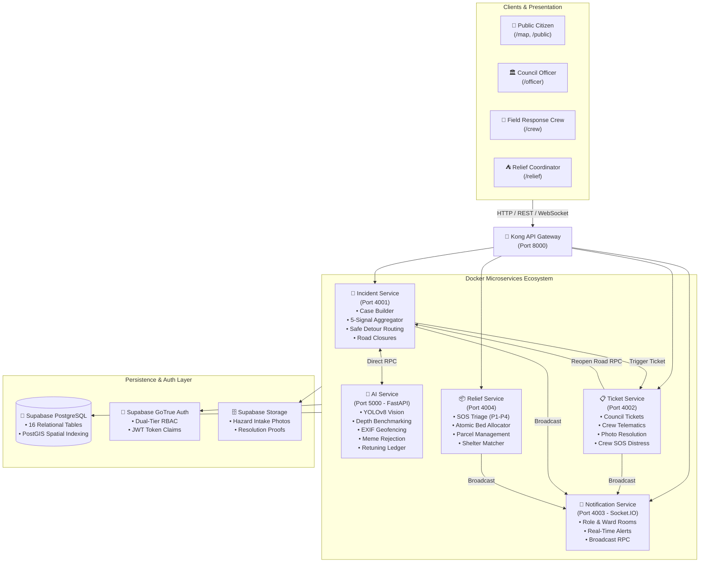

# Civic Guard — Disaster Response Intelligence & Coordination Platform

> **CodeArena '26 Ideathon · Topic 04: Disaster Response**  
> An end-to-end municipal and citizen emergency coordination platform that verifies citizen disaster reports using 5-signal hybrid intelligence, alerts affected populations with safe evacuation routes, dispatches specialized field response crews, coordinates relief shelters with atomic bed allocation, and maintains real-time public hazard maps.

---

## 🌟 Executive Summary

During severe monsoons, tropical depressions, and flash floods, urban infrastructure across Sri Lanka degrades rapidly: drainage networks back up, major rivers (such as the Kelani and Kalu rivers) overflow, critical roadways submerge, and fallen trees sever transportation arteries faster than local municipal councils can physically detect. 

While citizens post alerts and urgent pleas for assistance on social media, emergency response operations are hampered by three structural bottlenecks:
1. **Information Overload & Misinformation**: Unverified photos, recycled viral imagery, and exaggerated rumors overwhelm municipal emergency dispatchers.
2. **Delayed Hazard Detection**: Manual phone hotlines and physical ground surveys cannot keep pace with flash-flood velocity.
3. **Disconnected Response Silos**: Council officers, field rescue squads, relief coordinators, and vulnerable citizens operate without a synchronized operational picture, resulting in blocked evacuation routes, misallocated relief supplies, and premature road reopenings.

**Civic Guard** solves this through a **5-signal closed-loop disaster intelligence pipeline**. It combines deterministic geospatial and hydrological telemetry with computer vision AI (YOLOv8) to filter spam, verify hazards, issue authoritative road closures, calculate safe detour corridors, dispatch specialized response crews, coordinate relief shelters, and guarantee that closed roads are never reopened without verified photo proof.

---

## 🏛️ System Architecture

Civic Guard is built as a microservices architecture orchestrated via Docker Compose, secured through Kong API Gateway on port `8000`, and backed by Supabase PostgreSQL and Storage:



---

## ⚡ Key Core Features

### 1. 🛡️ 5-Signal Hybrid Verification Engine
Instead of relying solely on probabilistic AI or slow human dispatchers, incoming citizen hazard reports pass through a 5-signal verification pipeline (`incident-service` + `ai-service`):
- **Signal 1: Spatio-Temporal Clustering**: Aggregates nearby citizen reports within a 200-meter radius and 3-hour rolling window using indexed bounding-box spatial queries.
- **Signal 2: Hydrological & Weather Telemetry Correlation**: Correlates reported flood depths with real-time precipitation gauges and river water-level telemetry.
- **Signal 3: YOLOv8 Computer Vision & Flood Depth Benchmarking**: Uses YOLOv8 nano object detection and hydrological colorimetry to benchmark water depth (`SURFACE_PUDDLE`, `TIRE_LEVEL`, `BUMPER_LEVEL`, `SUBMERGED_VEHICLES`).
- **Signal 4: EXIF GPS & Scene Authenticity Validator**: Extracts hardware EXIF metadata, verifies image entropy to reject flat-background memes/spam (assigning a low 0.10 score), and calculates Haversine distance against Sri Lanka territorial boundaries (`5.9°N–9.9°N, 79.5°E–82.0°E`).
- **Signal 5: Multi-Criteria Risk Urgency Engine**: Computes dynamic risk urgency (P1 Critical through P4 Low) factoring road hierarchy, critical infrastructure proximity (hospitals, schools), and water rise velocity.
- **Continuous Feedback Ledger (Stage 6)**: Records false-positive/negative officer overrides via `/feedback` for continuous retraining.

### 2. ⛔ Authoritative Road Closures & Safe Detour Corridors
- When high-severity flood or blockage hazards are confirmed, Council Officers trigger authoritative road closures with one click.
- The **Safe Route Planner** (`/api/incidents/routes/safe-path`) dynamically re-routes citizens and field crews around closed road segments, snapping to OpenStreetMap centerlines and high-capacity bypass corridors (e.g., Baseline Road, Galle Road, High Level Road).
- Live road closure states are broadcasted instantaneously to all connected map clients via Socket.IO.

### 3. 🚒 Emergency Response Crew Command & Field SitRep Pipeline
- **Specialized Crew Tracks**: Field squads are categorized by tactical specialty (`WATER_RESCUE`, `4X4_DEBRIS`, `MEDICAL_TRIAGE`, `DRONE_RECON`, `HAM_RADIO`) across Sri Lanka's 25 administrative districts.
- **Smart Dispatch Rules**: Enforces a soft 2km proximity threshold with mandatory officer justification for emergency overrides.
- **Two-Tier SOS Distress Pinpoint**: Field crews can trigger an emergency SOS beacon (`crew:sos`), immediately flashing a high-priority pulsating siren banner and map pin on the Officer Tactical Command Center.
- **Photo-Verified Closed-Loop Resolution**: To prevent catastrophic premature road reopenings, tickets cannot be closed without an on-site photo proof, field SitRep notes, and civilian headcount. Submitting valid photo proof automatically resolves the hazard and reopens the road on the public map.

### 4. ⛺ Relief Logistics Desk & Shelter Network
- **P1–P4 SOS Distress Triage**: Stranded citizens submit SOS assistance requests categorized by urgency and special needs (medical, elderly, infant care, food, evacuation).
- **Atomic Conditional Bed Allocation (ADR-011)**: Employs PostgreSQL atomic transactions with row-level locking (`SELECT ... FOR UPDATE`) to prevent race-condition overbooking during mass evacuation spikes.
- **Multi-Resource Parcel Allocation**: Tracks and dispatches emergency food rations, clean water, first aid kits, blankets, and hygiene packs to designated relief centers.

### 5. 🔒 Dual-Tier Authentication & Municipal RBAC (ADR-025)
- **100% Open Public Access**: Citizens access the Public Hazard Map (`/map`, `/public`), view active road closures, plan safe routes, and report hazards with zero barrier to entry or mandatory account registration.
- **Role-Gated Operational Portals**: Municipal officers and field squads access restricted consoles (`/officer`, `/crew`, `/relief`) protected by `<ProtectedRoute>` guards, Supabase GoTrue authentication, and decoded JWT claims (`COUNCIL_OFFICER`, `FIELD_CREW`).

### 6. 🧪 Phase 4 Closed-Loop Integration Test Suite (ADR-026)
- **Native Container Healthchecks**: All 7 containers in `docker-compose.yml` declare native healthchecks with strict `condition: service_healthy` orchestration.
- **Automated Verification Harness**: Master scorecard runner (`backend/scripts/test-phase4-all.ts`) executing 22 integration tests in 25 seconds across Kong Gateway proxying, multi-ward storm bursts, and full end-to-end incident-to-reopening workflows.

---

## 🖥️ Operational Workspaces & Portals

The frontend web application (`web/`) is built with React 18, Vite, TypeScript, Tailwind CSS, and Leaflet, adhering to a high-contrast **Pure Light Mode** design system (ADR-022):

| Portal | URL Route | Target Audience | Primary Capabilities |
| :--- | :--- | :--- | :--- |
| **Public Hazard & Safe Route Map** | `/map` or `/public` | Citizens, Commuters, Donors | • Live hazard pins with severity badges<br>• Closed road red barrier indicators (`⛔ CLOSED`)<br>• Safe detour corridor planner<br>• Emergency shelter pins with available bed telemetry<br>• Citizen hazard report modal with photo upload & GPS pin-drop |
| **Council Officer Control Center** | `/officer` | Municipal Engineers, Disaster Officers | • Split-screen tactical command workspace<br>• Real-time ward-by-ward hazard triage grid<br>• 5-Signal Incident Command Inspector with YOLOv8 preview<br>• Distance-ranked crew dispatch queue<br>• Authoritative road closure manager<br>• Real-time crew SOS distress interception |
| **Field Crew Tactical Desk** | `/crew` | Emergency Squad Leads | • Assigned dispatch tickets with situational briefings<br>• Tactical navigation map avoiding closed roads<br>• Live GPS beacon broadcaster<br>• Emergency SOS trigger<br>• Photo-verified completion modal with SitRep notes |
| **Relief Logistics Desk** | `/relief` | Relief Coordinators, Red Cross | • Urgency-prioritized P1–P4 SOS triage queue<br>• Interactive shelter network map with live circular bed gauges<br>• Automated 1-click nearest shelter matching<br>• Multi-resource emergency parcel allocation modal |
| **Authentication Role Gateway** | `/login` | All Municipal Staff | • Tabbed gateway with 1-click demo persona quick-select<br>• Password authentication via Supabase GoTrue<br>• Direct links to open public citizen services |

---

## 👥 Demo Personas & Credentials

For evaluation, testing, and demonstrations, the platform includes pre-configured municipal user accounts seeded in Supabase Auth:

| Role | Operational Persona | Email | Password | Specialty / Assignment |
| :--- | :--- | :--- | :--- | :--- |
| **Council Officer** | Kasun Perera | `kasun.perera@civicguard.gov.lk` | `Officer@123` | Colombo Municipal Council Command Center |
| **Field Squad Lead** | Sunil Shantha | `sunil.shantha@civicguard.gov.lk` | `Crew@123` | Water Rescue Squad 01 (Colombo Ward 03) |
| **Field Squad Lead** | Bandara Senanayake | `bandara.senanayake@civicguard.gov.lk` | `Crew@123` | 4x4 Heavy Debris Crew 02 (Ratnapura District) |
| **Field Squad Lead** | Dr. Nimal Gamage | `dr.gamage@civicguard.gov.lk` | `Crew@123` | Mobile Medical Triage Squad 03 (Kandy District) |
| **Citizen / Commuter** | Public Citizen | *No login required* | *Open Access* | 100% Unrestricted (`/map`, `/public`) |

---

## 🚦 Network & Port Reference

All client traffic routes through Kong API Gateway on port `8000`:

| Component / Service | Internal Port | External / Host Port | Description |
| :--- | :---: | :---: | :--- |
| **Kong API Gateway** | `8000` | `8000` | Declarative reverse proxy, CORS pre-flight, multipart forwarding |
| **Operations Web Portal** | `80` | `3000` | React + Vite frontend (Pure Light Mode) |
| **Incident Service** | `4001` | `4001` | 5-Signal verification, road closures, safe routing, telemetry |
| **Ticket Service** | `4002` | `4002` | Council tickets, crew telematics, photo resolution, SOS |
| **Notification Service** | `4003` | `4003` | Socket.IO server (spatial rooms & broadcast RPC) |
| **Relief Service** | `4004` | `4004` | SOS triage, shelter matching, atomic bed allocation |
| **AI Computer Vision Service** | `5000` | `5000` | FastAPI Python service with YOLOv8 & heuristic fallback |
| **Supabase PostgreSQL** | `5432` | Cloud Hosted | 16 PostgreSQL tables, PostGIS, row-level security |

### Primary Gateway API Routes (`http://localhost:8000`)
- `POST /api/incidents/reports` — Citizen hazard report intake (supports multipart photos)
- `GET  /api/incidents/map/hazards` — Public map hazard feed with severity perimeters
- `POST /api/incidents/routes/safe-path` — Safe detour corridor calculation
- `PATCH /api/incidents/roads/:id/closure` — Authoritative road closure toggle
- `GET  /api/tickets` — Active tickets queue with crew assignments
- `PATCH /api/tickets/:id/assign` — Dispatch crew to ticket (soft 2km proximity check)
- `POST /api/tickets/:id/complete` — Photo-verified ticket completion & road reopening
- `POST /api/tickets/crews/:id/sos` — Trigger crew SOS distress beacon
- `POST /api/relief/help-requests` — Citizen SOS distress intake
- `POST /api/relief/match-shelter` — 1-click nearest shelter matcher with atomic allocation
- `POST /api/relief/resources/allocate-parcel` — Multi-resource parcel distribution
- `GET  /api/ai/health` — AI service health and YOLOv8 readiness
- `POST /api/ai/predict/hazard` — 5-signal multimodal hazard analysis

---

## 🚀 Getting Started

### 1. Prerequisites
Ensure the following tools are installed on your host system:
- **Docker** (v24+) and **Docker Compose** (v2+)
- **Node.js** (v18.x or v20.x) & **npm** (v9+)
- **Python** (v3.10+)

### 2. Clone the Repository & Configure Environment
```bash
git clone https://github.com/savindu-st/CivicGuard.git
cd CivicGuard

# Copy environment variables
cp .env.example .env
```

Ensure your `.env` contains valid Supabase credentials:
```env
SUPABASE_URL=https://your-project.supabase.co
SUPABASE_ANON_KEY=your-supabase-anon-key
SUPABASE_SERVICE_ROLE_KEY=your-supabase-service-role-key
JWT_SECRET=your-jwt-secret
```

### 3. Seed Supabase Auth Users
Provision the pre-configured municipal officer and crew accounts in Supabase:
```bash
npm run seed:auth --prefix backend
```

### 4. Start the Entire Platform with Docker Compose
Start all 7 containerized services with automated healthcheck orchestration:
```bash
docker compose up --build
```
Wait until all containers report `healthy`:
```bash
docker compose ps
```
You should see:
- `civicguard-ai-service` (healthy)
- `civicguard-incident-service` (healthy)
- `civicguard-ticket-service` (healthy)
- `civicguard-notification-service` (healthy)
- `civicguard-relief-service` (healthy)
- `civicguard-kong` (healthy)
- `civicguard-web` (healthy)

Access the web portal at: **[http://localhost:3000](http://localhost:3000)**

---

## 🧪 Automated Verification & Test Suites

The repository contains an automated integration test harness under `backend/scripts/` verifying every tier of the closed-loop system:

```bash
# Run all Phase 4 integration tests (Master Scorecard)
npm run test:all --prefix backend

# Or run individual test suites:
npm run test:kong --prefix backend     # Suite 1: Kong Gateway (8/8 tests)
npm run test:burst --prefix backend    # Suite 2: Weather Burst Simulation (5/5 tests)
npm run test:e2e --prefix backend      # Suite 3: Closed-Loop Lifecycle (9/9 tests)
```

### What the Test Suites Verify:
1. **Kong API Gateway (`test-kong-gateway.ts`)**:
   - Multi-service routing on port 8000 across all 5 backend microservices
   - HTTP status code and JSON error preservation
   - CORS pre-flight `OPTIONS` responses
   - Multipart photo uploads forwarded cleanly to microservices
2. **Multi-Ward Weather Burst Replay (`test-weather-burst.ts`)**:
   - Ingests simulated torrential rainfall (95mm/h) and river overflow (8.5m) across Colombo 01, Colombo 04, Colombo 07, Katubedda, and Kandy
   - Validates threshold breach triggers and automated Socket.IO warning broadcasts
3. **End-to-End Closed-Loop Workflow (`test-e2e-closed-loop.ts`)**:
   - **Negative Guards**: Verifies rejection of spam memes (assigning score < 0.30) and rejection of ticket completion attempts lacking photo proof
   - **Full Positive Loop**: Citizen report $\rightarrow$ 5-signal AI verification $\rightarrow$ officer review $\rightarrow$ automated road closure $\rightarrow$ safe route generation around closure $\rightarrow$ council ticket generation $\rightarrow$ field crew dispatch $\rightarrow$ photo-verified resolution with SitRep notes $\rightarrow$ automatic road reopening $\rightarrow$ public hazard map clearance $\rightarrow$ Stage 6 AI retuning ledger recording

---

## 📁 Repository Directory Structure

```text
CivicGuard/
├── backend/
│   ├── package.json                      # Workspaces root (shared, services/*)
│   ├── scripts/                          # Automated Integration Test Harness
│   │   ├── migrate.ts                    # Supabase ticket column migration runner
│   │   ├── test-kong-gateway.ts          # Kong port 8000 verification suite
│   │   ├── test-weather-burst.ts         # Weather burst sensor replay suite
│   │   ├── test-e2e-closed-loop.ts       # Closed-loop lifecycle verification
│   │   └── test-phase4-all.ts            # Master test orchestrator
│   ├── services/
│   │   ├── ai-service/                   # Python FastAPI + YOLOv8 vision engine
│   │   │   ├── app/                      # Schemas, checks, and API routes
│   │   │   ├── tests/                    # 14 Pytest verification tests
│   │   │   └── Dockerfile
│   │   ├── incident-service/             # Port 4001: 5-Signal verification & routing
│   │   ├── ticket-service/               # Port 4002: Ticket lifecycle & crew dispatch
│   │   ├── notification-service/         # Port 4003: Socket.IO real-time hub
│   │   └── relief-service/               # Port 4004: SOS requests & shelter bed allocation
│   └── shared/                           # @civicguard/shared TypeScript library
│       ├── types/                        # Incident, ticket, relief, user DTOs
│       ├── utils/                        # Haversine, auth guard, Supabase client
│       └── constants/                    # Events, statuses, thresholds
│
├── web/                                  # Operations Web Portal (React 18 + Vite)
│   ├── src/
│   │   ├── components/                   # Modals, maps, triage grids, tactical cards
│   │   ├── pages/
│   │   │   ├── auth/LoginPage.tsx        # Role-based municipal login gateway
│   │   │   ├── officer/                  # Council Officer Control Center
│   │   │   ├── crew/                     # Field Crew Tactical Desk
│   │   │   ├── relief/                   # Relief Logistics Desk
│   │   │   └── public/                   # Public Hazard & Safe Route Map
│   │   ├── services/                     # Supabase & Axios API clients
│   │   └── store/                        # Zustand Auth & Session state
│   └── Dockerfile
│
├── database/                             # Database Migrations & Seeds
│   ├── migrations/
│   │   └── 001_initial_schema.sql        # 16 Relational tables
│   └── seed/
│       ├── 002_seed_sri_lanka_wards.sql  # Real Sri Lanka wards, roads & crews
│       ├── 003_seed_relief_sos.sql       # Demo SOS distress requests
│       └── 004_provision_supabase_auth.ts # Supabase GoTrue Auth user provisioning
│
├── kong/                                 # Kong API Gateway declarative config
│   └── kong.yml                          # Route mappings to microservices
├── docker-compose.yml                    # Multi-container orchestration & healthchecks
├── architecture.md                       # Master architecture specification & ADRs 001–026
├── progress.md                           # Milestone tracking & change log
└── README.md                             # Project documentation
```

---

## 📚 Architecture Decision Records (ADRs)

Key architectural decisions are documented in [`architecture.md`](architecture.md):

| ADR | Title | Summary |
| :--- | :--- | :--- |
| **ADR-001** | Monorepo with npm Workspaces | Unified dependency management across backend services and `@civicguard/shared`. |
| **ADR-003** | 5-Signal Hybrid Verification Pipeline | Combines spatial clustering, hydrological telemetry, YOLOv8 vision, EXIF geofencing, and risk urgency. |
| **ADR-005** | Photo-Verified Incident Resolution Closed Loop | Mandatory photo proof required before closed roads can be reopened on public maps. |
| **ADR-006** | Kong API Gateway Ingress | Centralized routing, CORS, and multipart file upload proxying on port `8000`. |
| **ADR-011** | Atomic Conditional Bed Allocation | Concurrency-safe shelter bed reservation preventing race-condition overbooking. |
| **ADR-012** | Crowdsourced Corroboration Engine | Citizen confirm/refute voting for "Need More Info" hazard reports. |
| **ADR-014** | Safe Detour Evacuation Routing | Algorithmic bypass route generator avoiding active road closures. |
| **ADR-016** | Field Crew Subsystem & SOS Interception | Crew dispatch with 2km soft limit, two-tier SOS emergency beacon, and telematics. |
| **ADR-017** | Modular AI Vision & Retuning Ledger | YOLOv8 depth benchmarking, meme rejection, and Stage 6 continuous feedback ledger. |
| **ADR-018** | Split-Screen Officer Tactical Center | Ward triage grid, YOLOv8 inspector, and authoritative road closure controls. |
| **ADR-020** | Unified Relief Logistics Desk | Urgency-ranked SOS triage (P1–P4) with spatial bed capacity telemetry. |
| **ADR-021** | Public Hazard Map & Detour Viewer | Open public hazard viewer with dual-mode pin-drop reporting and safe route planning. |
| **ADR-022** | Pure Light Mode Design System | High-contrast clean UI overhaul (`bg-slate-50`, pure white card elevation) across all portals. |
| **ADR-023** | Response Crew Hierarchy & Field SitRep | Specialty tracks (`WATER_RESCUE`, `4X4_DEBRIS`, etc.) with ground SitRep schema. |
| **ADR-025** | Dual-Tier Access via Supabase Auth | 100% open citizen access + role-gated municipal access via Supabase GoTrue JWTs. |
| **ADR-026** | Closed-Loop Integration Test Suite | Docker healthchecks + automated TypeScript verification runners for all services. |

---

## 🏆 Ideathon Information

- **Event**: CodeArena '26 Ideathon
- **Topic**: Topic 04 — Disaster Response
- **Project**: Civic Guard — Coordinating City Response to Floods and Road Hazards
- **Repository**: [https://github.com/savindu-st/CivicGuard](https://github.com/savindu-st/CivicGuard)
- **License**: MIT
