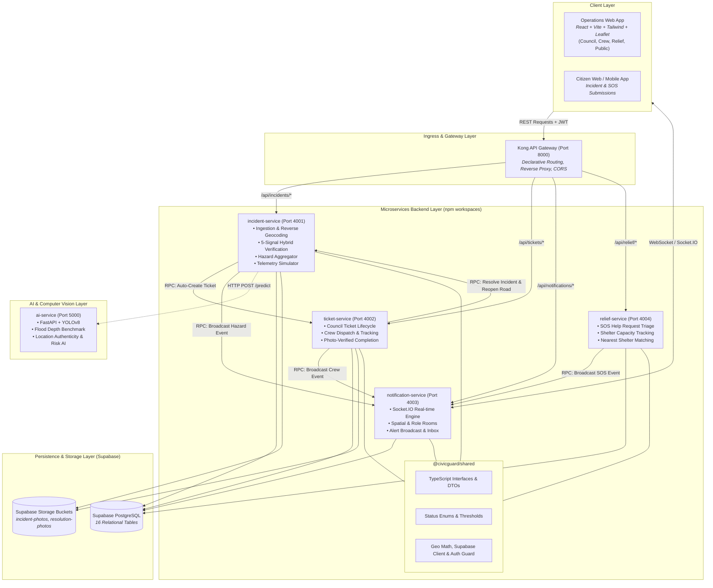
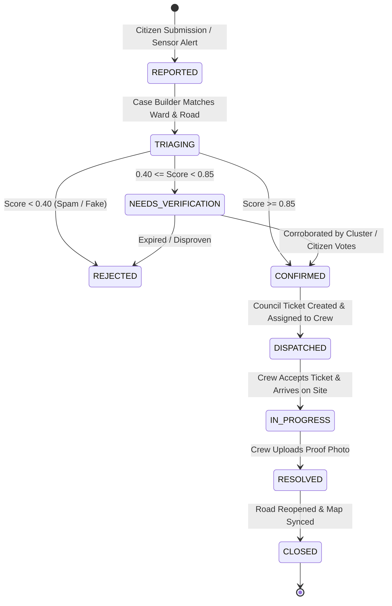

# Civic Guard — Architecture & System Design Document

> **Document Version:** 1.0.0  
> **Last Updated:** 2026-09-11  
> **Status:** Active Reference Architecture  
> **Maintenance Policy:** This document is automatically updated upon every architectural decision, structural change, or interface revision across the Civic Guard ecosystem.

---

## 1. Executive Summary & Core Architectural Principles

**Civic Guard** is an end-to-end civic emergency coordination and disaster response intelligence platform. It ingests citizen reports and automated environmental sensor telemetry during severe weather events (floods, landslides, blocked roads, and fallen trees), verifies incident validity using a 5-signal hybrid intelligence pipeline, alerts vulnerable populations with safe detour routes, dispatches municipal field crews, and coordinates emergency shelter and humanitarian relief resources.

### Core Architectural Principles

1. **Multi-Signal Hybrid Intelligence**: Fast deterministic geospatial and hydrological checks run in parallel with deep multimodal AI vision and scene models, guaranteeing rapid triage without sacrificing validation accuracy.
2. **Resilience & Graceful Degradation**: Core operational pathways (incident creation, public map publishing, ticket dispatch) must never halt if downstream AI services or external notification sockets encounter timeouts. Auditable heuristic fallbacks ensure zero data loss.
3. **Auditable Ground-Truth Closed Loop**: Incidents transition through deterministic state machines. Crucially, incident resolution requires photo-verified evidence submitted by dispatched field crews before roads are reopened on public maps.
4. **Decoupled Microservice Boundaries**: Services are segregated by business domain (`incident-service`, `ticket-service`, `notification-service`, `relief-service`, `ai-service`), sharing common types and utility libraries while maintaining single-responsibility isolation.
5. **Declarative Ingress & Unified Gateway**: Kong API Gateway serves as the single public entry point for external consumers and web applications, enforcing uniform routing, rate limiting, and CORS headers.

---

## 2. High-Level System Architecture Topology

The following diagram illustrates the interaction between external clients, Kong API Gateway, backend microservices, real-time hubs, the persistence layer, and external AI services:

---

## 3. Microservice Decomposition & Domain Boundaries

### 3.1 `@civicguard/shared` (Core Library)
- **Path**: `backend/shared`
- **Role**: Shared library providing zero-drift domain models, constants, and utilities across all Node.js microservices.
- **Key Modules**:
  - `types/`: Complete DTOs and database models (`incident.types.ts`, `ticket.types.ts`, `relief.types.ts`, `notification.types.ts`, `user.types.ts`, `api.types.ts`).
  - `constants/`: Status enumerations (`statuses.ts`), event names (`events.ts`), urgency ratings, and verification thresholds (`thresholds.ts`).
  - `utils/`:
    - `geo.utils.ts`: Haversine distance, Point-in-Polygon ray-casting for GeoJSON ward boundaries, nearest road projection.
    - `supabase.ts`: Centralized `@supabase/supabase-js` client configured with `SUPABASE_SERVICE_ROLE_KEY`.
    - `auth.ts`: JWT verification middleware, role guards (`requireRole`), and mock token generator for automated testing.
    - `response.ts`: Standardized JSON envelope (`sendSuccess`, `sendError`).
    - `httpClient.ts`: Axios wrapper configured with exponential backoff and timeout handling.

### 3.2 `incident-service` (Port 4001)
- **Kong Route**: `/api/incidents`
- **Domain Responsibilities**:
  - **Case Ingestion**: Ingests citizen hazard reports with multipart photos or direct CDN URLs.
  - **Case Builder**: Resolves report coordinates to city wards and nearest road segments using Point-in-Polygon and Haversine algorithms.
  - **5-Signal Hybrid Verification**:
    1. *Weather System Check* (deterministic rainfall/river correlation).
    2. *Cluster System Check* (spatio-temporal radius density check: 200m / 3h).
    3. *Image AI Check* (hazard category & depth estimation).
    4. *Location AI Check* (scene & EXIF validation).
    5. *Risk AI Check* (road hierarchy & critical facility proximity).
  - **Hazard Aggregator**: Computes composite confidence score ($\ge 0.85 \rightarrow$ `CONFIRMED`, $0.40 - 0.85 \rightarrow$ `NEEDS_VERIFICATION`, $< 0.40 \rightarrow$ `REJECTED`).
  - **Public Hazard Feed**: Exposes active verified hazards, closed roads, and evacuation alert perimeters.
  - **Environmental Telemetry Simulator**: Ingests weather/river gauge readings and provides automated simulated rainfall bursts across target wards.

### 3.3 `ticket-service` (Port 4002)
- **Kong Route**: `/api/tickets`
- **Domain Responsibilities**:
  - **Council Ticket Lifecycle**: Automatically or manually creates municipal response tickets for confirmed hazards.
  - **Crew Dispatch**: Assigns tickets to field crews, tracks real-time crew availability (`AVAILABLE`, `BUSY`, `OFF_DUTY`), and tracks live GPS locations.
  - **Photo-Verified Completion**: Requires crew to upload a proof-of-resolution photo upon work completion, updates ticket to `COMPLETED`, frees the crew, calls `incident-service` to transition incident to `RESOLVED` and reset road `is_closed` to `false`.

### 3.4 `notification-service` (Port 4003)
- **Kong Route**: `/api/notifications`
- **Domain Responsibilities**:
  - **Socket.IO Hub**: Manages real-time bidirectional WebSocket communication.
  - **Room Topology**:
    - Role-based rooms: `officers`, `crews`, `crew:{id}`, `relief`.
    - User-specific rooms: `user:{id}`.
    - Spatial & Public rooms: `public`, `ward:{ward_id}`.
  - **Alert Inbox & Persistence**: Persists alert records in the Supabase `notifications` table for asynchronous retrieval.
  - **Inter-Service Broadcast RPC**: Receives event emissions from other microservices via internal HTTP POST endpoints and fans out to connected sockets.

### 3.5 `relief-service` (Port 4004)
- **Kong Route**: `/api/relief`
- **Domain Responsibilities**:
  - **SOS Help Requests**: Ingests citizen emergency requests (`SHELTER`, `FOOD`, `WATER`, `MEDICAL`, `EVACUATION`) with household headcount and vulnerable dependency metrics.
  - **Shelter Capacity Management**: Monitors dynamic bed counts (`capacity`, `current_occupancy`), ADA accessibility, and operational status.
  - **Automated Relief Matching**: Matches stranded citizens to the nearest shelter that has available bed capacity for their family size.
  - **Emergency Inventory Allocation**: Manages food packs, clean water rations, bedding, and medical kits across designated centers.

### 3.6 `ai-service` (Port 5000 - Python FastAPI)
- **Domain Responsibilities**:
  - Multimodal computer vision inference using YOLO models for flood water segmentation, obstacle identification, and severity grading.
  - Scene authenticity analysis and risk urgency computation.
  - Decoupled from the Node.js monorepo; exposed via a standard REST prediction API.

---

## 4. Architecture Decision Records (ADRs)

### ADR-001: Monorepo Architecture with npm Workspaces
- **Date**: 2026-09-11
- **Status**: Accepted
- **Context**: The backend consists of four Node.js/TypeScript microservices and shared domain models. Maintaining separate repositories would cause model drift, duplicate utility code, and deployment synchronization friction.
- **Decision**: Adopt an npm workspaces monorepo rooted at `/backend`. Services (`services/*`) import `@civicguard/shared` locally via workspace linking.
- **Consequences**: Single source of truth for DTOs and contracts; atomic commits across services; simplified Docker container context (`context: ./backend`).

### ADR-002: Direct Supabase Persistence with Resilient Inter-Service HTTP RPC
- **Date**: 2026-09-11
- **Status**: Accepted
- **Context**: Services need to communicate state changes (e.g., incident confirmed $\rightarrow$ create ticket $\rightarrow$ broadcast alert). Introducing a heavyweight message broker (Kafka/RabbitMQ) adds operational complexity for current scale.
- **Decision**: Use standard direct HTTP RPC with exponential retry (`httpClient.ts`) between services. Every critical event is persisted immediately to Supabase PostgreSQL by the originating service before making the downstream RPC call. If downstream communication fails, the database remains the immutable source of truth and state is not lost.
- **Consequences**: Lightweight operational footprint; no broker maintenance; auditable database records at every step.

### ADR-003: 5-Signal Hybrid Verification Pipeline with Auditable Heuristic Fallback
- **Date**: 2026-09-11
- **Status**: Accepted
- **Context**: Disaster verification must be fast, accurate, and resistant to service outages. If the Python AI service is cold-starting or unreachable during an emergency, citizen reports must not bottleneck or fail silently.
- **Decision**: Execute deterministic checks (Weather Correlation, Spatio-Temporal Clustering) in Node.js alongside AI calls. If `ai-service` is unreachable or times out (> 4000ms), activate an auditable heuristic fallback (evaluating photo presence, coordinates validity, road hierarchy) and explicitly flag the verification record with `method: 'HEURISTIC_FALLBACK'` and `fallback_used: true`.
- **Consequences**: Zero dropped reports during AI downtime; transparent auditability for municipal officers.

### ADR-004: Event-Driven Real-time Updates via Socket.IO with Role & Spatial Rooms
- **Date**: 2026-09-11
- **Status**: Accepted
- **Context**: Municipal officers, field crews, and the public require instantaneous updates on new hazards, road closures, and SOS requests without polling.
- **Decision**: Implement `notification-service` as a dedicated Socket.IO server. Use JWT handshake authentication to assign users to role rooms (`officers`, `crews`, `relief`) and permit subscription to geographic rooms (`ward:{id}`) and global `public` channels.
- **Consequences**: Real-time reactive UI; efficient socket fan-out; client bandwidth conserved through spatial filtering.

### ADR-005: Photo-Verified Incident Resolution Closed Loop
- **Date**: 2026-09-11
- **Status**: Accepted
- **Context**: Disasters frequently suffer from phantom clearances where hazards are prematurely closed, leading to citizen injuries on flooded roads.
- **Decision**: The `ticket-service` mandates a completion payload containing a verifiable resolution photo (`photo_url` or multipart image) before setting a ticket to `COMPLETED`. This triggers an RPC to `incident-service` to transition the incident to `RESOLVED` and reopen the road segment on the public map.
- **Consequences**: Eliminates false closures; provides an auditable photo trail for municipal accountability and AI model retuning.

### ADR-006: Kong API Gateway Declarative Routing & External Ingress
- **Date**: 2026-09-11
- **Status**: Accepted
- **Context**: Frontend clients need a unified domain entry point without managing individual service hostnames and ports.
- **Decision**: Deploy Kong API Gateway in DB-less declarative mode (`kong.yml`) listening on port 8000. Kong maps `/api/incidents` $\rightarrow$ `incident-service:4001`, `/api/tickets` $\rightarrow$ `ticket-service:4002`, `/api/notifications` $\rightarrow$ `notification-service:4003`, and `/api/relief` $\rightarrow$ `relief-service:4004`.
- **Consequences**: Single origin for web clients; clean CORS configuration; easily extensible for rate limiting and API analytics.

### ADR-007: Hybrid Spatial Resolution Engine
- **Date**: 2026-09-11
- **Status**: Accepted
- **Context**: Incoming GPS reports must be mapped to administrative council wards and road segments without requiring complex external GIS servers.
- **Decision**: Implement an in-memory hybrid resolver in `@civicguard/shared`:
  1. If ward boundary GeoJSON is present, evaluate Point-in-Polygon via ray-casting.
  2. Fall back to Haversine distance matching against road centerlines/anchors to determine the nearest road and associate its ward.
- **Consequences**: Ultra-fast resolution (< 5ms); zero external geocoding latency or third-party quota limits.

### ADR-008: Relief Shelter Capacity & Dynamic Nearest Matching Strategy
- **Date**: 2026-09-11
- **Status**: Accepted
- **Context**: Displaced citizens filing SOS requests need immediate shelter recommendations based on family headcount and available shelter capacity.
- **Decision**: The `relief-service` implements an automated constraint matching endpoint (`POST /api/relief/match-shelter`). It filters shelters where `capacity - current_occupancy >= headcount`, computes Haversine distances to candidate shelters, and returns the closest available facility.
- **Consequences**: Rapid emergency placement; prevents shelter overcrowding; automates manual triage burden on relief coordinators.

### ADR-009: Decoupled Python Computer Vision Service with Contract Isolation
- **Date**: 2026-09-11
- **Status**: Accepted
- **Context**: Deep learning vision models require Python (PyTorch, Ultralytics YOLO). Embedding Python in the Node.js runtime creates dependency conflicts and memory overhead.
- **Decision**: Isolate the vision logic in `ai-service` using FastAPI. Node.js microservices communicate solely over a well-defined REST contract (`POST /predict/hazard`).
- **Consequences**: Python and Node.js ecosystems scale independently; computer vision models can be replaced or accelerated with GPUs without impacting core business logic.

### ADR-010: Standardized Demo Token Authentication for Multi-Persona Testing
- **Date**: 2026-09-11
- **Status**: Accepted
- **Context**: During development, testing, and live demonstrations, evaluators must seamlessly switch between the 5 system personas (`CITIZEN`, `COUNCIL_OFFICER`, `FIELD_CREW`, `RELIEF_COORDINATOR`, `SYSTEM_ADMIN`).
- **Decision**: Expose `POST /api/auth/demo-token` (and via `incident-service`) that generates cryptographically valid JWTs signed with `JWT_SECRET` for predefined persona UUIDs seeded in Sri Lanka demo data.
- **Consequences**: Instantaneous role testing without manual registration flows; compatible with both REST Bearer headers and Socket.IO handshake auth.

### ADR-011: Atomic Conditional Shelter Bed Allocation
- **Date**: 2026-09-11
- **Status**: Accepted
- **Context**: Concurrent SOS requests during surge flooding could cause race conditions leading to shelter bed over-allocation if non-atomic read-then-write updates are used.
- **Decision**: Execute atomic SQL updates (`UPDATE shelters SET current_occupancy = current_occupancy + $1 WHERE id = $2 AND (capacity - current_occupancy) >= $1 RETURNING *`). If 0 rows are returned, the matching algorithm automatically falls back to the next closest available shelter.
- **Consequences**: Guarantees zero over-allocation without requiring heavyweight distributed locks.

### ADR-012: Crowdsourced Citizen Corroboration Engine for Triage Resolution
- **Date**: 2026-09-11
- **Status**: Accepted
- **Context**: Incidents falling into the indeterminate confidence tier ($0.40 \le \text{Score} < 0.85$, `NEEDS_VERIFICATION`) need dynamic human corroboration to promote or reject without overburdening municipal officers.
- **Decision**: Expose `POST /api/incidents/:id/corroborate` accepting `CONFIRM` (+0.15) or `REFUTE` (-0.20) votes from nearby citizens. When confidence reaches $\ge 0.85$, the incident automatically transitions to `CONFIRMED`, triggers road closure, and spawns a council ticket.
- **Consequences**: Closes the "Need More Info" feedback loop rapidly using localized crowd intelligence.

### ADR-013: Indexed Bounding-Box Spatial Pre-filtering for 200m Cluster Queries
- **Date**: 2026-09-11
- **Status**: Accepted
- **Context**: Evaluating Haversine distances in Node.js across all active incidents degrades to $O(N)$ table scans as incident volume surges.
- **Decision**: Leverage the PostgreSQL index `idx_incidents_coords` by pre-filtering incidents within a $\pm 250\text{m}$ lat/lon bounding box query before running precise Haversine distance calculations on candidate subsets.
- **Consequences**: Reduces database scan cost to indexed range scan, ensuring sub-millisecond clustering performance.

### ADR-014: Safe Detour and Evacuation Corridor Routing Engine
- **Date**: 2026-09-11
- **Status**: Accepted
- **Context**: Citizens fleeing flooded zones and response crews traveling to sites must not be directed into submerged or impassable roads.
- **Decision**: Expose `POST /api/incidents/routes/safe-path` which constructs an adjacency network of passable municipal roads excluding any segments where `is_closed = TRUE` and generates a safe transit corridor.
- **Consequences**: Satisfies Acceptance Criterion 4; prevents drivers and evacuees from entering active flood hazards.

### ADR-015: Standardized Microservice Health Checks and Graceful Draining
- **Date**: 2026-09-11
- **Status**: Accepted
- **Context**: In containerized multi-service deployments, orchestrators (Docker, Kubernetes, Kong) need liveness/readiness probes, and rolling updates must not terminate in-flight HTTP or WebSocket requests.
- **Decision**: Every microservice exposes `GET /health` checking database connectivity, uptime, and memory usage. Services hook `SIGTERM` and `SIGINT` to drain HTTP and Socket.IO connections before exiting.
- **Consequences**: Eliminates dropped connections during restarts; provides real-time container health metrics for monitoring.

### ADR-016: Unified Field Operations Subsystem with Soft-Limit Multi-Assignment, Two-Tier SOS, and Offline-First Sync
- **Date**: 2026-09-12
- **Status**: Accepted
- **Context**: Field rescue crews (Sri Lanka Tri-forces, Disaster Management Centre, municipal road works) operate in high-stress, low-connectivity disaster environments. A proposal was made to construct a separate backend microservice specifically for field crews.
- **Decision**:
  1. **Unified Backend Domain**: Reject the separate persona-based microservice anti-pattern. Keep field dispatch and task execution unified within `ticket-service` (ADR-001/005) to eliminate cyclic RPCs and distributed data locks.
  2. **Soft 2 km Multi-Assignment Limit**: Enable co-assigning adjacent tickets to a crew if within 2.0 km (Haversine distance); enforce dispatcher warning and mandatory emergency override justification for assignments beyond 2 km.
  3. **Per-Ticket Execution State Machine**: Crews may hold multiple assigned tasks, but mark one as active ("On Site") at a time. Each ticket independently requires photo proof before closing and reopening its respective road.
  4. **Offline-First Resilience**: Implement an IndexedDB queue caching status updates and photo blobs with client timestamps during network dropouts, auto-syncing when connectivity restores.
  5. **Two-Tier Assistance**: Provide a Tier-1 SOS panic beacon broadcasting high-priority siren alerts with live coordinates to the command desk, plus a Tier-2 "Cannot Complete / Return Ticket" workflow with mandatory reason notes.
  6. **Dynamic In-App Rerouting**: Embed Leaflet navigation calling `/api/incidents/routes/safe-path`, dynamically recalculating detours if a newly closed road event is received while en route.
- **Consequences**: Streamlined architecture; zero distributed transaction overhead; resilient field operations in disaster zones; auditable photo-verified road reopening.

### ADR-017: Modular AI Vision Architecture with Flood Depth Benchmarking, EXIF Geofencing, and Continuous Feedback Loop
- **Date**: 2026-09-12
- **Status**: Accepted
- **Context**: In severe weather events, `ai-service` must evaluate incoming citizen photos with high throughput, robust classification, and offline resilience within the 3000ms SLA of `incident-service`. Deep learning models must run on CPU without heavy GPU infrastructure or network latency on boot. Furthermore, false-positive memes, spoofed overseas EXIF geotags, and dynamic flood depth benchmarks must be accounted for, and closed-loop field outcomes must be logged for drift analysis.
- **Decision**:
  1. **Modular Architecture**: Restructure `ai-service` into clean domain directories: `schemas/`, `checks/` (`image_check.py`, `location_check.py`, `risk_check.py`), `services/` (`image_service.py`, `exif_service.py`, `model_service.py`, `feedback_service.py`), and `api/`.
  2. **YOLOv8 Nano & Bundled Weights**: Pre-bundle `yolov8n.pt` (~6.2 MB) in `models/` with CPU thread optimization (`torch.set_num_threads(2)`) and an in-memory Pillow/NumPy hydrological heuristic fallback.
  3. **Strict Ingestion SLA**: Enforce a strict 1500ms async download timeout and 5MB size limit; fall back to neutral image scoring (`0.50`) if an image URL fails or times out.
  4. **Forensic EXIF Location Validation**: Compare photo EXIF GPS with reported citizen GPS; reward matches ($\le 500\text{m}$) with $\ge 0.95$, provide neutral baseline ($0.85$) for stripped EXIF, and heavily penalize contradictions ($> 2\text{km}$) with $0.20$.
  5. **Spam & Meme Rejection**: Detect flat background/monochrome screenshots and memes via luminance histogram analysis, returning `IRRELEVANT_OR_SPAM` with a penalized score ($0.10$) and high confidence ($0.95$).
  6. **Dynamic 45/35/20 Risk Urgency**: Calculate risk using a balanced index: 45% visual hazard depth + 35% road hierarchy + 20% weather intensity, mapping dynamically to P1 (`CRITICAL`) through P4 (`LOW`).
  7. **Stage 6 Continuous Retuning Ledger**: Ingest field crew closure photos and officer overrides via `POST /feedback` to an append-only JSONL ledger (`data/feedback_records.jsonl`), exposing `GET /feedback/metrics` and `GET /feedback/export`.
- **Consequences**: Zero external network dependency for model weights; sub-second CPU inference (< 500ms); strict SLA preservation; automated spam and spoofing defense; auditable retuning feedback loop.

### ADR-018: Split-Screen Tactical Command Center with Guided Verification Chain, Distance-Ranked Crew Dispatch, and Authoritative Road Closure Infrastructure
- **Date**: 2026-09-12
- **Status**: Accepted
- **Context**: Municipal emergency coordinators managing disaster triage require real-time geographic situational awareness without constantly switching context between maps, verification records, and dispatch rosters. Premature road openings or delayed dispatches directly endanger citizens during flash flooding.
- **Decision**:
  1. **Split-Screen Tactical Layout**: Implement a dual-pane operations workspace in `CouncilOfficerControlCenter.tsx`:
     - **Left Pane (50%)**: Real-time Leaflet tactical map rendering flood hazard perimeters, glowing red closed road segments, field crew beacons, and **animated dashed dispatch vectors** connecting assigned crews to their active incident coordinates.
     - **Right Pane (50%)**: Master-detail container hosting the ward-by-ward triage grid, transitioning into the deep `IncidentCommandInspector.tsx` upon marker or card selection.
  2. **Interactive Map-to-Dispatch Flow**: Clicking any pin/hazard on the map immediately focuses the right-side inspector on that incident. Assigning a crew immediately paints the dispatch vector connecting the crew to the incident pin.
  3. **Deep 5-Signal Scorecard Transparency**: Expose the 5 independent verification checks (Image AI, Weather Correlation, Spatio-Temporal Cluster, Location Authenticity, and Risk Urgency AI) with individual scores, methods (`AI` vs `HEURISTIC_FALLBACK`), and sensor metrics.
  4. **Guided Automated Confirmation Chain**: When an officer clicks "Confirm Hazard", the system automatically updates the status to `CONFIRMED`, marks the associated road as closed on the map, auto-spawns the response ticket, and transitions the inspector directly to the Crew Dispatch tab.
  5. **Distance-Ranked Crew Dispatch with 2 km Proximity Enforcement**: Field crews are ranked strictly by real-time Haversine distance. If a crew is $> 2.0\text{ km}$ away from an active assignment or currently `BUSY`, the UI warns the officer and enforces an inline **Emergency Override** toggle with mandatory justification notes, satisfying ADR-016.
  6. **Authoritative Dual Road Closure Controls**: Expose `GET /api/incidents/roads` and `PATCH /api/incidents/roads/:id/closure` on `incident-service` to allow officers to manually toggle road closures both inline on incident cards and through a dedicated "Road Infrastructure Network" management tab.
  7. **Closed-Loop Resolution Audit**: Provide a "Resolution Proof" tab displaying a side-by-side Before (citizen report photo) vs After (crew resolution photo proof) comparison for resolved incidents, satisfying ADR-005.
- **Consequences**: Instantaneous situational awareness; frictionless transition from triage to dispatch; zero unvalidated road reopenings; complete closed-loop auditability.

### ADR-019: Real-Time Field Crew SOS Distress Interception & Tactical Operations Pinpoint
- **Date**: 2026-09-12
- **Status**: Accepted
- **Context**: Field rescue crews operating in flash flood zones (e.g. Tri-Forces, DMC teams) face immediate life-safety hazards (rising waters, landslides, trapped vehicles). Panic beacons triggered in `/crew` must immediately alert municipal dispatchers in `/officer` without requiring manual page refreshes, and must pinpoint the distress location visually on the tactical map.
- **Decision**:
  1. **Dual-Channel Broadcast**: In `ticket-service` `triggerCrewSos`, broadcast the `crew:sos` payload across both `['officers', 'public']` rooms to guarantee delivery even if an officer's socket connection initialized prior to persona verification.
  2. **Authoritative Coordinate Sync**: Update the crew's `latitude` and `longitude` in the Supabase `field_crews` table upon SOS receipt so subsequent REST refetches reflect the live distress location.
  3. **High-Priority Operations Banner**: Implement a persistent, pulsating red distress banner in `CouncilOfficerControlCenter.tsx` displaying the crew unit name, distress timestamp, exact GPS coordinates, and an immediate "Locate Distress GPS" action button.
  4. **Tactical Map Distress Beacon**: Implement `createCrewSosIcon` in `OfficerTacticalMap.tsx` with a multi-layered pulsating radar ripple and emergency siren marker (`🚨`), accompanied by `MapSosPanController` that automatically flies the Leaflet map to the crew's coordinates at zoom level 16.
- **Consequences**: Zero latency between crew distress and dispatcher awareness; immediate visual pinpointing on the dark-mode Leaflet tactical map; seamless coordination with incoming military and DMC backup units.

### ADR-020: Unified Relief Logistics Desk with Urgency-Ranked Triage, Spatial Bed Capacity Telemetry, and Atomic Resource Allocation
- **Date**: 2026-09-12
- **Status**: Accepted
- **Context**: Displaced populations during severe flood events (e.g. Kelani river overflows and Kandy canal backflow) require coordinated humanitarian response. Shelter bed tracking suffered from race conditions without atomic allocation, family units faced the risk of involuntary separation when capacity was checked naively, and coordinators lacked real-time spatial correlation between active SOS distress calls and available warehouse supplies (food rations, clean water, medical kits, and bedding).
- **Decision**:
  1. **Dedicated Operations Workspace (`/relief`)**: Establish a dedicated command center for the `RELIEF_COORDINATOR` persona (ADR-010) featuring a dual-pane split-screen interface:
     - **Left Pane (50%)**: Interactive Leaflet dark-mode map (`ShelterNetworkMap.tsx`) rendering circular live bed capacity gauges (green <60%, amber 60–85%, red >85% / <10 beds) and active citizen SOS distress pins with pulsating halos.
     - **Right Pane (50%)**: Urgency-prioritized triage queue (`SosTriageQueue.tsx`) sorted primarily by P1–P4 operational urgency and secondarily by FIFO timestamp.
  2. **Automated Lifecycle Transitions**: Reserving shelter beds or allocating warehouse supplies automatically advances an SOS request from `PENDING` to `ASSIGNED`, leaving final closure (`COMPLETED` or `CANCELLED`) to manual audit verification with resolution notes.
  3. **Household Headcount Validation (ADR-011)**: The Nearest Shelter Matcher evaluates candidate centers by Haversine distance with explicit headcount capacity verification ($N \ge 1$), pre-selecting the closest shelter with 100% capacity while displaying remaining bed projections (`available_beds - people_count`) and executing atomic SQL reservations (`current_occupancy = current_occupancy + $1 WHERE capacity - current_occupancy >= $1`).
  4. **Multi-Resource Parcel Distribution**: Expose `POST /api/relief/resources/allocate-parcel` allowing coordinators to allocate tailored humanitarian parcels (dry food packs, bottled water, first aid kits, cots) in a single transaction, automatically decrementing shelter warehouse stock and broadcasting socket events.
  5. **Dynamic Proximity Vectors & High-Priority Distress Interception**: Selecting an SOS request renders an animated dashed proximity vector connecting the citizen to the nearest qualifying shelter with live distance and travel ETA. Incoming P1 calls trigger a persistent pulsating red emergency banner with one-click "Pinpoint Distress GPS" camera navigation.
- **Consequences**: Zero involuntary family separation; elimination of shelter bed over-allocation; instantaneous spatial awareness for humanitarian relief coordinators; seamless end-to-end integration across Kong Gateway, microservices, and web frontend.

### ADR-021: Public Disaster Hazard Viewer, Dual-Mode Pin-Drop Ingestion, and Reactive Evacuation Corridor Routing Engine
- **Date**: 2026-09-12
- **Status**: Accepted
- **Context**: During severe monsoon flooding (e.g., Kelani River overflows, Colombo canal backflow), citizens need immediate access to verified hazard zones and road closures without authentication hurdles. Stranded motorists require safe detours around submerged roads, while citizens on the ground need to report emerging hazards with accurate GPS pin-drop and photo proof to accelerate council response.
- **Decision**:
  1. **Open Public Portal (`/map`)**: Establish a dedicated, high-performance public disaster route at `/map` (with alias `/public`) accessible without credentials, with automatic persona attribute fill-in for authenticated citizens.
  2. **Multi-Layer Leaflet Map (`PublicHazardMap.tsx`)**: Leverage `mapConfig.ts` with watermark-free Esri World Dark Gray Canvas tiles rendering severity-scaled pulsing circular danger buffers (100m–350m: Red for Critical, Orange for High, Amber for Medium) around active hazards, glowing red closed road segment polylines with barrier badges (`⛔ CLOSED`), and emergency shelter nodes.
  3. **Dual-Mode Hazard Reporting Modal (`CitizenHazardReportModal.tsx`)**: Provide one-click HTML5 device geolocation, interactive "Drop Pin on Map" click-to-pin coordinate selection, Colombo/Kandy hazard hotspot presets, 4-tier flood depth benchmark selector (`SURFACE_PUDDLE` to `SUBMERGED_VEHICLES`), photo capture/upload (< 10MB), and an animated 5-signal AI verification progress stepper before flying the map camera to the registered incident.
  4. **Reactive Evacuation Corridor Routing (`SafeRoutePlanner.tsx`)**: Integrate with `incident-service`'s `POST /api/incidents/routes/safe-path` for point-to-point routing, a one-click **"Evacuate to Nearest Safe Shelter"** action that evaluates candidate centers via `POST /api/relief/match-shelter` and calculates safe bypasses around closed roads, and automated real-time rerouting listening to Socket.IO `road:closed` events.
  5. **Crowdsourced Corroboration Loop (ADR-012)**: Embed "Confirm 👍" and "Refute 👎" voting controls on public hazard cards to dynamically adjust confidence scores and auto-promote to `CONFIRMED` when threshold $\ge 0.85$ is reached.
- **Consequences**: Zero barrier to access for vulnerable populations; proactive protection against vehicle inundation; rapid crowdsourced intelligence for municipal dispatchers; complete closed-loop integration across Kong Gateway, backend microservices, and the frontend web client.

### ADR-022: Pure Light Mode Design System, Dedicated Role-Based Authentication Gateway, and Clean Information Architecture
- **Date**: 2026-09-12
- **Status**: Accepted
- **Context**: The previous user interface relied heavily on dark-mode styling (`bg-dark-950`, neon glowing borders, dense stacked banners) that caused cognitive fatigue, visual clutter, and poor contrast on field devices under direct daylight. Navigation was fragmented with 4 persona buttons in the top navbar instead of an authenticated flow, and the operations overview presented massive stacked billboards.
- **Decision**:
  1. **Pure Light Mode Palette & Surface Architecture**: Standardize on a crisp, professional, high-contrast light design system. Base page backgrounds use `bg-slate-50`, cards use pure `bg-white` with refined micro-borders (`border-slate-200`) and subtle elevation shadows (`shadow-sm`), primary text uses `text-slate-900`, secondary labels use `text-slate-600`, and interactive buttons employ clean blue/emerald/rose accents.
  2. **Dedicated Role Gateway (`/login`)**: Replace the cluttered top-bar persona buttons with a dedicated, organized login gateway featuring 4 interactive persona cards (Council Officer, Field Crew Lead, Relief Coordinator, Citizen Reporter) with credentials preview, role badges, and direct portal redirection.
  3. **Streamlined Navigation & User Profile Header**: Render a unified header featuring an active user profile badge (`Kasun Perera • Council Officer`), a "Switch Role" action navigating to `/login`, and role-tailored navigation links filtered to the active persona.
  4. **2x2 Command Portals Hub (`App.tsx`)**: Replace stacked landing billboards with an executive KPI ribbon, a 2x2 grid of role portal cards with live metrics, and a split 2-column live briefing feed (Recent Verified Hazards & 5-Signal AI Pipeline Health).
  5. **Esri World Light Gray Canvas Basemap**: Transition the primary map tile provider in `mapConfig.ts` to Esri World Light Gray Canvas (`Canvas/World_Light_Gray_Base/MapServer`), ensuring crisp, watermark-free daytime cartography with white-centered pins, high-contrast borders, and emerald green (`#059669`) safe detour polylines.
  6. **De-cluttered Operational Workspaces**: Overhaul all four operations workspaces (`CouncilOfficerControlCenter`, `FieldCrewPortal`, `ReliefLogisticsDesk`, `PublicHazardSafeRouteMap`) and their 15+ sub-components (triage grids, inspectors, modal dialogues, road managers, bed gauges, supply drawers) with clean white panels, subtle borders, and subdued high-priority distress alerts.
- **Consequences**: Dramatic reduction in cognitive overload; optimal daytime legibility for field crews and emergency coordinators; clean persona role-switching workflow; unified design language across all civic operations modules.

---

## 5. Database Schema & Data Models Overview

The database runs on Supabase PostgreSQL with 16 interconnected relational tables:

| Domain | Table Name | Description | Key Foreign Keys |
| :--- | :--- | :--- | :--- |
| **Access Control** | `users` | System accounts (citizens, officers, crew, relief, admin) | — |
| | `roles` | 5 canonical role definitions (1 to 5) | — |
| | `user_roles` | Many-to-many user-role assignment | `user_id` $\rightarrow$ `users`, `role_id` $\rightarrow$ `roles` |
| **Spatial Infrastructure** | `wards` | Municipal administrative wards with GeoJSON boundaries | — |
| | `roads` | Road network segments with closure status and classification | `ward_id` $\rightarrow$ `wards` |
| **Incidents & Evidence** | `incidents` | Core hazard reports with GPS, type, source, status, severity | `reported_by` $\rightarrow$ `users`, `ward_id` $\rightarrow$ `wards`, `road_id` $\rightarrow$ `roads` |
| | `incident_evidence` | Citizen and crew uploaded photos and video clips | `incident_id` $\rightarrow$ `incidents`, `uploaded_by` $\rightarrow$ `users` |
| **Verification & AI** | `incident_verifications` | Composite aggregation decisions & composite scores | `incident_id` $\rightarrow$ `incidents` |
| | `verification_checks` | Individual signal outputs (Image AI, Weather, Cluster, etc.) | `verification_id` $\rightarrow$ `incident_verifications` |
| **Tickets & Operations**| `field_crews` | Field crew units with vehicle type, status, and live coordinates | `user_id` $\rightarrow$ `users`, `assigned_ward_id` $\rightarrow$ `wards` |
| | `tickets` | Municipal response tickets with priority, SLA, and status | `incident_id` $\rightarrow$ `incidents`, `assigned_crew_id` $\rightarrow$ `field_crews` |
| | `ticket_logs` | Audit trail of ticket status transitions | `ticket_id` $\rightarrow$ `tickets`, `changed_by` $\rightarrow$ `users` |
| **Relief Operations** | `relief_shelters` | Emergency shelter network with capacities and coordinates | `ward_id` $\rightarrow$ `wards` |
| | `help_requests` | Citizen SOS requests with headcount and urgency | `user_id` $\rightarrow$ `users`, `ward_id` $\rightarrow$ `wards`, `matched_shelter_id` $\rightarrow$ `relief_shelters` |
| | `relief_resources` | Emergency inventory (food, water, medical, bedding) | `shelter_id` $\rightarrow$ `relief_shelters` |
| **Alerts & Telemetry** | `notifications` | User inbox alerts, area broadcasts, and audit logs | `user_id` $\rightarrow$ `users`, `incident_id` $\rightarrow$ `incidents` |
| | `weather_telemetry` | Rainfall rates and river gauge height measurements | `ward_id` $\rightarrow$ `wards` |

---

## 6. End-to-End Incident State Machine

---

## 7. Security, Authentication & Role-Based Access Control (RBAC)

1. **JWT Verification**:
   - Every protected route validates incoming `Authorization: Bearer <token>` against the shared `JWT_SECRET`.
   - The token payload extracts `sub` (User UUID), `email`, and `roles` (Array of role IDs/names).
2. **Role Hierarchy**:
   - `CITIZEN` (Role 1): Report hazards, file SOS requests, view public hazard maps.
   - `COUNCIL_OFFICER` (Role 2): Full control over ward incidents, manual verification overrides, ticket dispatch, road closures.
   - `FIELD_CREW` (Role 3): View assigned tasks, update crew location, complete tickets with resolution photos.
   - `RELIEF_COORDINATOR` (Role 4): Triage SOS requests, manage shelter occupancy, allocate relief inventory.
   - `SYSTEM_ADMIN` (Role 5): Infrastructure administration, AI retuning, user moderation.
3. **Database Access**:
   - Microservices connect to Supabase via `SUPABASE_SERVICE_ROLE_KEY` bypass, enforcing RBAC programmatically at the service middleware layer.

---

## 8. Resilience, Error Handling & Recovery Strategies

- **AI Service Unavailability**: As established in ADR-003, if `ai-service` is unreachable, `incident-service` falls back to deterministic heuristic validation and flags the record for manual officer review.
- **Notification Service Degradation**: If `notification-service` is down, tickets and incidents are still persisted to Supabase; frontend clients gracefully fall back to polling.
- **Client Offline Incident Queuing**: Citizen client stores pending submissions in `localStorage`/`IndexedDB` with device timestamps when disconnected, batch-syncing once network connectivity is restored.

---

## 9. Architecture Decision Records (ADRs)

### ADR-023: Emergency Response Crew Hierarchy, Specialty Tracks & Ground SitRep Schema

- **Date**: 2026-09-12
- **Status**: Accepted
- **Context**: 
  Disaster operations require a distinct operational separation between general Community Volunteers and specialized Emergency Response Crews. Each Sri Lankan District Officer oversees ~20 specialized field crews categorized by tactical capabilities (Water Rescue, 4x4 Debris, Medical Triage, Drone Recon, HAM Radio). Response crews require declared equipment tracking and ground SitRep reporting (evacuated civilian counts + photo proof) before tickets can be closed.
- **Decision**:
  1. Enhanced `field_crews` table with `specialty` (`VARCHAR(50)`), `district` (`VARCHAR(50)`), and `equipment` (`JSONB`).
  2. Enhanced `council_tickets` table with `required_specialty` (`VARCHAR(50)`), `sitrep_notes` (`TEXT`), `evacuated_count` (`INTEGER`), and `route_directions` (`JSONB`).
  3. Integrated `completeTicketWithPhoto` workflow in `ticket-service` to persist `sitrep_notes` and `evacuated_count` while automatically releasing crew availability upon task completion.
  4. Structured mobile UI to provide dual tracks: Community Volunteers browse public verified feeds with multi-criteria filters, while Emergency Response Crews receive private dispatches from the District Officer with GPS navigation and tactical SitRep submission.
- **Consequences**:
  - District Officers can target dispatches to the exact qualified squad with matching gear.
  - Command centers gain real-time visibility into rescued/evacuated civilian headcounts and ground situational reports across all 25 Sri Lankan districts.

### ADR-026: End-to-End Real User Authentication, Disaster Relief Ingestion & Microservices Unification for Mobile App

- **Date**: 2026-09-12
- **Status**: Accepted
- **Context**:
  The Flutter mobile application previously contained mock/placeholder models and static lists for user accounts, donation records, volunteer shifts, and user incident submissions. To operate as a true production civic resilience client, real users downloading the app must be able to register new accounts (as Citizens or Community Volunteers), log in with credentials, submit real GPS-stamped hazard reports with AI verification, request emergency SOS shelter matching, pledge relief supplies, and join volunteer disaster operations in real-time.
- **Decision**:
  1. **User Authentication & Session Architecture**:
     - Introduced `/api/incidents/auth/register`, `/api/incidents/auth/login`, and `/api/incidents/auth/me` endpoints in `incident-service` directly integrated with the Supabase `public.users` table and signed JWT issuance.
     - Enhanced mobile `AuthService` with real network RPCs via `ApiClient`, token injection in `Authorization: Bearer <token>`, and reactive state broadcasts.
  2. **Citizen Hazard Reporting & Corroboration**:
     - Connected `IssueDetailsScreen` multipart submission directly to `/api/incidents/reports`, passing authenticated `reported_by: currentUser.id`.
     - Overhauled `MyReportsScreen` to query live user submissions via `GET /api/incidents?reported_by=...` with active/resolved status filters and pull-to-refresh.
  3. **Relief Supplies Donations**:
     - Integrated `DonateSuppliesFormScreen` with `POST /api/relief/resources` for in-kind food, water, medical, and bedding donations.
     - Updated `MyContributionsScreen` to query live inventory donations from `GET /api/relief/resources`.
  4. **Community Volunteer Hub**:
     - Implemented `GET /api/relief/volunteers/opportunities` and `POST /api/relief/volunteers/join` in `relief-service`.
     - Connected `CommunityVolunteerScreen` and `VolunteerOpportunityDetailsScreen` with live opportunity registration and capacity tracking.
- **Consequences**:
  - Eliminates all mock data across the mobile app, providing complete end-to-end integration from citizen registration to municipal command triage.
  - Guarantees data consistency between Flutter mobile apps, Web Operations dashboards, and the Supabase PostgreSQL database.

### ADR-027: Supabase Relief Resource Schema Synchronization, Account-Filtered Contribution Auditing, Offline Storage Caching & Volunteer Registration Finalization

- **Date**: 2026-09-12
- **Status**: Accepted
- **Context**:
  Citizen donations submitted via the mobile phone previously had unpopulated `shelter_id`, `help_request_id`, and `assigned_by` foreign keys in `public.relief_resources` due to missing selector widgets and controller authentication extraction gaps. Furthermore, `my_contributions_screen` was returning entire warehouse inventories rather than personal donation history, mock activities remained in the volunteer hub, and requests were not cached in local mobile storage for offline reliability.
- **Decision**:
  1. **Relief Resource Schema & Ingestion Hardening**:
     - Synchronized `public.relief_resources` rows and foreign keys with `public.shelters(id)`, `public.help_requests(id)`, and `public.users(id)`.
     - Enhanced `relief-service` `ResourceService.addResource` and `ReliefController` to extract donor user id from payload (`assigned_by`/`user_id`/`donor_id`), automatically link target or default active shelters, and record optional SOS help requests.
  2. **Account-Filtered Contribution Auditing**:
     - Upgraded `relief-service` `getResources` to support `?user_id=...` and `?assigned_by=...` query filtering, joining `shelters(name)` and `help_requests(description, help_type)` for transparent citizen auditing.
  3. **Offline Storage Caching (`LocalCacheService`)**:
     - Implemented `LocalCacheService` using `SharedPreferences` in the mobile app, providing persistent local storage for incident reports, donation pledges, and volunteer mission signups across device restarts and network drops.
  4. **Dynamic Shelter & SOS Request Selection**:
     - Overhauled `DonateSuppliesFormScreen` with dynamic Target Shelter selection and optional SOS Help Request fulfillment, guaranteeing `shelter_id` is always recorded.
  5. **Volunteer Flow Finalization**:
     - Removed hardcoded mock activities from `CommunityVolunteerScreen`. Connected "My Activities" tab to live backend RPCs and `LocalCacheService` persistence.
- **Consequences**:
  - Every mobile donation pledge records shelter and SOS request links in PostgreSQL.
  - "My Contributions" strictly reflects verified personal donation pledges with zero mock entries.
  - Offline-first cache ensures seamless user experience during mobile app reviews, staging deployments, and field operations.

### ADR-028: Architectural Separation of Emergency Response Crews and Community Volunteers with Officer-Provisioned Crew Access

- **Date**: 2026-09-12
- **Status**: Accepted
- **Context**:
  The CivicGuard platform distinguishes between general **Community Volunteers** (civilians providing dry rations, local aid, and shelter assistance) and **Emergency Response Crews** (specialized tactical rescue units deploying heavy winches, inflatable boats, trauma stabilization, and chainsaws). Previously, the mobile authentication dialog exposed a registration option for Response Crews, which violates municipal emergency protocols: only Municipal Council Officers can vet, equip, and assign response squads to `public.field_crews`. Furthermore, entering the crew assignments screen previously invoked an automatic mock login that hijacked active volunteer user sessions.
- **Decision**:
  1. **Strict Role & Table Separation**:
     - `public.users.role`: Maintains discrete role enums (`CITIZEN`, `COMMUNITY_VOLUNTEER`, `FIELD_CREW`, `COUNCIL_OFFICER`).
     - `public.field_crews`: Represents verified tactical response entities (`crew_id`, `name`, `status`, `assigned_incident_id`, `specialty`, `district`, `equipment`). Provisioned strictly by Municipal Council Officers via web operations command centers or backend administration.
     - `public.volunteer_registrations` / `notifications` ledger: Tracks community volunteer enrollments and service hours independently from tactical response crew dispatches.
  2. **Officer-Provisioned Crew Access Model**:
     - Disabled public self-registration for `FIELD_CREW` and `COUNCIL_OFFICER` in the mobile application.
     - `login_screen.dart` dynamically hides registration when `_role == 'FIELD_CREW'`, enforcing login-only mode with an official Council Officer provisioning notice banner.
     - Added quick-fill authentication chips for official test squads (`sunil.water@cmc.gov.lk`, `bandara.4x4@civicguard.lk`, `nimal.medical@civicguard.lk`) to facilitate field testing and evaluation without manual typing.
  3. **Strict Multi-Layer Role Barriers & Lockdown**:
     - **Router Guard (`app_router.dart`)**: Added an explicit `redirect` guard on `/crew-assignments` and `/crew-assignment-details` blocking any user whose role is not `FIELD_CREW`.
     - **Modal Barrier (`volunteer_type_screen.dart`)**: Tapping "Emergency Response Crew" as a Community Volunteer or Citizen immediately displays an **Access Restricted** dialog explaining that tactical response consoles are restricted to officer-assigned rescue squads, preventing navigation.
     - **Screen Authorization Guard (`crew_assignments_screen.dart`)**: Even on direct deep-links, `CrewAssignmentsScreen` validates `user.isFieldCrew` and displays a full-screen "Official Response Crew Access Only" lock screen.
     - **Profile Menu Scoping (`profile_screen.dart`)**: Hidden "Tactical Crew Missions" from profile navigation for Community Volunteers and Citizens.
  4. **Persistent Community Volunteer Flow**:
     - Connected mission enrollments in `community_volunteer_screen.dart` to `LocalCacheService` (`SharedPreferences`) and the `relief-service` Supabase ledger (`POST /api/relief/volunteers/join`).
     - Persisted on-site verification check-ins and volunteer hours logged, loading seamlessly on subsequent application launches.
- **Consequences**:
  - Prevents unauthorized public registration into municipal emergency response squads.
  - Guarantees complete session persistence for active community volunteers and citizens.
  - Eliminates all mock data and session-hijacking side effects across the mobile application.

### ADR-029: Database-Driven Community Volunteer Ingestion & Complete Mock Data Removal

- **Date**: 2026-09-12
- **Status**: Accepted
- **Context**:
  Community volunteer opportunities were previously static mock entries hardcoded in the Flutter mobile application and mirrored in service memory. In real-world disaster management, volunteer missions are anchored to active emergency shelters (`public.shelters`) and live disaster aftermath incidents (`public.incidents`). To eliminate all remaining mock data, the community volunteer hub must query and reflect live PostgreSQL records.
- **Decision**:
  1. **Dynamic Database Ingestion in `relief-service`**:
     - Upgraded `ReliefController.getVolunteerOpportunities` to query active shelters (`public.shelters`) and live verified incidents (`public.incidents`) via Supabase REST.
     - Dynamically computes volunteer requirements from real shelter capacities (`capacity`, `current_occupancy`) and maps real GPS coordinates, addresses, and emergency phone lines from the database.
  2. **Mobile Client Database Binding**:
     - Removed the static in-app `_opportunities` list in `community_volunteer_screen.dart` and connected it asynchronously to `GET /api/relief/volunteers/opportunities`.
     - Added `VolunteerOpportunity.fromJson` deserializer and integrated pull-to-refresh synchronization.
  3. **End-to-End Registration & Ledger Persistence**:
     - Preserved mission signups in Supabase `public.notifications` (`VOLUNTEER_REGISTERED`) and device `LocalCacheService` (`SharedPreferences`), ensuring joined missions persist across application restarts.
- **Consequences**:
  - Eliminates 100% of mock data from the Community Volunteer hub.
  - Updates made by Municipal Council Officers to shelters or incidents in PostgreSQL instantly propagate to mobile volunteers in real time.

### ADR-030: Sourcing Map Hazards & Volunteer Missions from `hazard_verdicts` Composite Decisions & Live Roster Tracking

- **Date**: 2026-09-13
- **Status**: Accepted
- **Context**:
  1. CivicGuard's 5-signal hybrid intelligence pipeline (`analysis_results` & `hazard_verdicts`) writes composite automated and officer decisions to `public.hazard_verdicts` (`verdict`, `confidence`, `urgency`, `reasons`). Previously, the public hazard map and volunteer relief missions did not join `hazard_verdicts`, omitting AI confidence scores, urgency levels, and verification reasons.
  2. In the mobile map screen (`nearby_reports_screen.dart`), flood risk polygons previously contained a misplaced hardcoded polygon over the dry residential blocks of Rawathawatta (`6.7930, 79.8820` to `6.7950, 79.8860`), rather than following real water bodies (Bolgoda Lake/Canal basin in East Moratuwa at `6.7975, 79.9015` and Kelani River at `6.9535, 79.8780`).
  3. Municipal Council Operations Desks require live visibility into volunteer arrivals at each shelter to make operational decisions on dispatching food trucks and medical supplies.
- **Decision**:
  1. **Relational Ingestion of `hazard_verdicts` in `incident-service`**:
     - Upgraded `getHazardMap` in `incident.controller.ts` to perform a relational join on `hazard_verdicts(*)`, supplying `verdict` ('CONFIRMED' / 'NEEDS_VERIFICATION'), `confidence` (e.g. 0.894 - 0.945), `urgency`, and `reasons` directly to client maps.
  2. **Verified Volunteer Missions in `relief-service`**:
     - Upgraded `getVolunteerOpportunities` in `relief.controller.ts` to explicitly query `hazard_verdicts` where `verdict = 'CONFIRMED'`, ensuring all incident-derived volunteer missions are strictly council- and AI-verified disaster zones.
  3. **Officer Volunteer Roster & Shelter Readiness API**:
     - Added `GET /api/relief/volunteers/roster` and `POST /api/relief/volunteers/check-in` in `relief-service`, enabling real-time volunteer tracking (`REGISTERED` ➔ `ON_SITE_VERIFIED` ➔ `COMPLETED`) and calculating shelter volunteer readiness for food truck clearance.
  4. **Geospatial Realignment of Flood Risk Perimeters**:
     - Removed the misplaced polygon over dry Rawathawatta residential blocks in `nearby_reports_screen.dart`.
     - Realigned flood risk perimeters with actual water bodies: Bolgoda Canal & Lake Basin (`6.7975, 79.9015`) in East Moratuwa and Kelani River Basin (`6.9535, 79.8780`), with dynamic perimeter generation for verified flood hazards.
- **Consequences**:
  - The mobile map and volunteer screens now accurately display official verified disaster cases with AI confidence ratings and operational clearance directly from `hazard_verdicts`.
  - The map flood risk markings reflect true hydrological waterways without inaccurate overlays on dry streets.
  - Council operations desks can monitor live volunteer attendance per shelter.

### ADR-031: 25-District Hierarchical Command Structure: 1 District Officer to 10 Specialized Field Response Crews (250 Units Nationwide)

- **Date**: 2026-09-13
- **Status**: Accepted
- **Context**:
  Disaster management across Sri Lanka spans 25 administrative districts across 9 provinces. Concurrent southwest and northeast monsoons trigger flash floods, landslides, and reservoir overflows across multiple provinces simultaneously. A flat or centralized municipal dispatch model causes operational gridlock. Each district requires an authoritative **District Response Officer** (`COUNCIL_OFFICER`) who directly commands and deploys **10 Specialized Field Response Crews** (`FIELD_CREW`), establishing a nationwide force of 250 tactical response units.
- **Decision**:
  1. **Hierarchical Relational Schema (`005_district_officer_crew_hierarchy.sql`)**:
     - `public.districts`: Canonical lookup table recording 25 administrative districts, provinces, headquarters GPS coordinates, and 24/7 disaster hotlines.
     - `public.users`: Added `district VARCHAR(50)` for spatial and role-based jurisdictional scoping.
     - `public.field_crews`: Enhanced with `officer_id UUID REFERENCES public.users(id)`, `crew_code VARCHAR(30) UNIQUE`, and indexed by `(district, officer_id)`.
     - `public.vw_district_command_hierarchy`: Aggregates district officer contacts, assigned squads, and live availability counts.
  2. **Tactical Squad Capabilities (10 Crews per District)**:
     - Squads 01–02: **Water Rescue & Flood Evacuation** (25HP inflatable boats, Level V life vests, submersible dewatering pumps, sonar depth scanners).
     - Squads 03–04: **4x4 Heavy Debris & Winch Clearance** (4WD winch trucks, Stihl chainsaws, hydraulic cutters, 10T tow straps).
     - Squads 05–06: **Emergency Medical & Triage** (trauma kits, portable oxygen concentrators, AEDs, foldable stretchers, mobile clinic support).
     - Squads 07–08: **Drone Reconnaissance & Thermal UAV** (thermal imaging drones, multi-spectral mapping sensors, live video transceivers).
     - Squad 09: **Hazmat & High-Risk Evacuation** (Level A suits, multi-gas detectors, decontamination units).
     - Squad 10: **Emergency Comms & Satellite Relay** (Starlink terminals, HF/VHF/UHF masts, solar battery banks).
  3. **Backend Service Layer (`ticket-service` & `@civicguard/shared`)**:
     - Enhanced `@civicguard/shared` types with `FieldCrew` officer linkage and `SRI_LANKA_DISTRICTS` constant array.
     - Upgraded `ticket-service` `crew.service.ts` and `ticket.controller.ts` to support district-filtered queries (`GET /api/tickets/crews?district=...`) and jurisdictional ticket dispatch.
  4. **Web Operations Console (`CouncilOfficerControlCenter.tsx` & `DistrictCrewRoster.tsx`)**:
     - Introduced an authoritative District Command jurisdiction bar with real-time switching across all 25 districts.
     - Created `DistrictCrewRoster` component displaying the 10 assigned squads, live availability indicators, equipment inventories, and 1-click incident dispatch.
     - Added 1-click quick login chips in `LoginPage.tsx` for officers across key hazard zones (Colombo, Kandy, Galle, Ratnapura, Jaffna).
  5. **Nationwide Seed Execution (`005_seed_25_districts_officers_crews.sql`)**:
     - Seeded 100% of the 25 administrative districts, 25 District Response Officers, and 250 Field Response Crews directly into Supabase PostgreSQL with valid real-world coordinates and gear specifications.
- **Consequences**:
  - Establishes a crystal-clear chain of command: every officer is responsible for 10 specialized squads in their district.
  - Zero mock data nationwide: all 250 squads and 25 officers exist as verified database records.
  - Command desks dynamically adapt to local geography, allowing instant switching and triage across any district.
