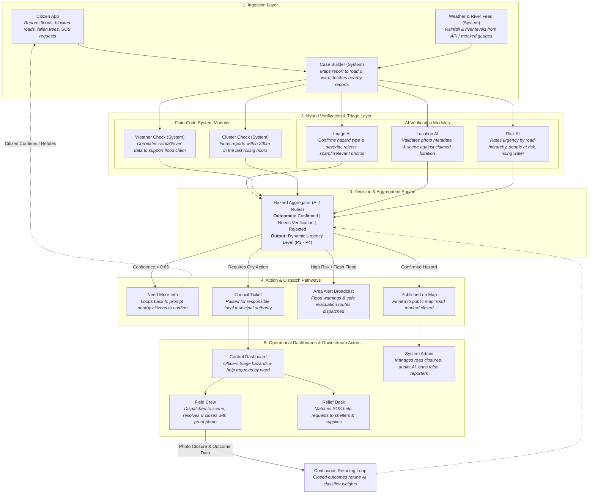
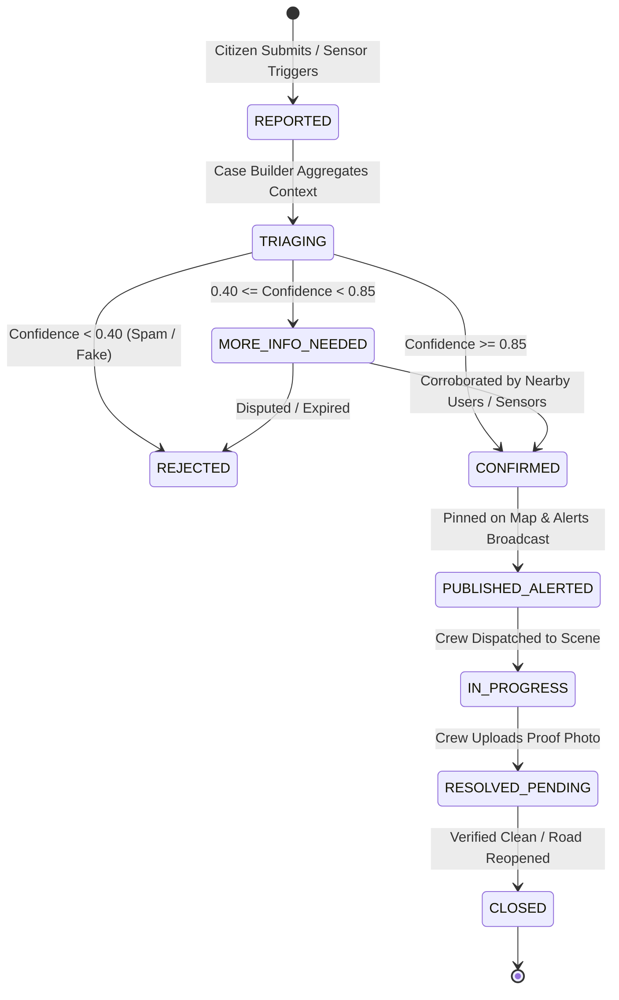

# Civic Guard: System Architecture & Operational Workflow

This document details the end-to-end architectural pipeline, verification mechanisms, operational states, and human-in-the-loop workflows of **Civic Guard**.

---

## 1. End-to-End Architectural Pipeline

The following diagram illustrates the reference system architecture and data progression across system components, AI models, and user touchpoints:



---

## 2. Detailed Workflow Stages

### Stage 1: Ingestion & Case Initialization
1. **Citizen Submission**:
   - The citizen captures a photo and inputs details via the **Citizen App**.
   - The device attaches high-precision GPS coordinates, timestamp, and device telemetry.
   - Alternatively, an SOS Help Request is initiated detailing household headcounts, trapped status, or medical dependencies.
2. **Environmental Gauge Ingestion**:
   - The **Weather & River Feed** service continually polls river level gauges and weather radar APIs (or replay simulator).
   - If rainfall rate exceeds thresholds (e.g., > 35 mm/hr) or river crest levels reach critical stages, automated area alerts are initialized.
3. **Case Builder Processing**:
   - The incoming report is ingested by the **Case Builder**.
   - The Case Builder performs reverse geocoding to resolve the incident to a specific street segment, neighborhood, and council ward.
   - It queries the database for existing active incidents within a spatial radius (e.g., 200m) and temporal window (last 3 hours) to assemble a complete incident context package.

---

### Stage 2: Parallel Hybrid Verification Pipeline

The incident package is dispatched concurrently across five independent verification nodes:

```
                  ┌───────── Case Context Package ─────────┐
                  │                                        │
     [Multimodal AI Analysis]                 [Deterministic Plain Code]
     ├─ Image AI (Vision)                     ├─ Weather Correlation Engine
     ├─ Location Scene AI                     └─ Spatio-temporal Cluster Engine
     └─ Risk Urgency AI
```

#### 2.1 Plain-Code Checks (Deterministic & Fast)
- **Weather System Check**:
  - Compares report coordinates against hyper-local precipitation logs and hydrological runoff models.
  - *Metric*: Returns a binary or graded score indicating whether meteorological conditions support the reported water accumulation.
- **Cluster System Check**:
  - Applies a spatial density algorithm (e.g., DBSCAN or geohash-based radius search).
  - *Metric*: Counts independent reports within 200 meters filed within the last 180 minutes. Higher cluster counts boost report authenticity.

#### 2.2 AI-Powered Checks (Multimodal & Context-Aware)
- **Image AI**:
  - Uses deep vision models to classify hazard category (`Flood`, `Blocked Road`, `Fallen Tree`, `Debris`, `None/Irrelevant`).
  - Estimates flood depth benchmarks (e.g., *tire-level*, *bumper-level*, *submerged vehicles*).
  - Flags and rejects invalid images (screenshots, memes, indoor photos, recycled stock photos).
- **Location AI**:
  - Compares visual scenery cues (road width, vegetation, surrounding architecture) and EXIF metadata with the claimed geographical location.
  - Flags discrepancies where metadata indicates manipulation or synthetic generation.
- **Risk AI**:
  - Evaluates impact criticality:
    $$\text{Urgency} = f(\text{Road Hierarchy}, \text{Surrounding Population}, \text{Rate of Water Rise}, \text{Proximity to Critical Facilities})$$
  - Outputs an urgency rating from **P1 (Critical / Life Threatening)** to **P4 (Minor / Informational)**.

---

### Stage 3: Hazard Aggregation & Decision Engine

The **Hazard Aggregator** fuses outputs from all verification modules into an overall confidence score:

| Composite Score | Status Decision | Next Action |
| :--- | :--- | :--- |
| **Score $\ge 0.85$** | `CONFIRMED` | Instant publication, road closure, warning broadcast, and ticket creation. |
| **$0.40 \le$ Score $< 0.85$** | `NEEDS_VERIFICATION` | Triggers "Need More Info" loop; queues for manual officer review. |
| **Score $< 0.40$** | `REJECTED` | Archived silently; suspicious accounts flagged for review. |

---

### Stage 4: Multi-Channel Action & Distribution

Once aggregated, the platform triggers four parallel actions:

1. **Need More Info Loop**:
   - Pushes an unobtrusive prompt to active app users located within 300 meters: *"A flood was reported near your street. Can you confirm if the road is passable?"*
   - Upvotes and downvotes dynamically adjust the incident confidence score.
2. **Map Publication**:
   - The hazard is rendered on the public interactive map with a clear visual perimeter.
   - Connected routing engines update traffic weights, marking the segment impassable.
3. **Area Alerts & Safe Routing**:
   - Citizens in the affected polygon receive push notifications detailing hazard severity.
   - The app dynamically computes evacuation/transit routes navigating strictly through safe, unflooded street segments.
4. **Council Ticket Dispatch**:
   - An incident ticket is registered in the municipal queue with assigned priority, required crew equipment (pumps, chainsaws, barricades), and estimated resource requirements.

---

### Stage 5: Field Operations & Resolution Lifecycle

1. **Control Dashboard Triage**:
   - Council officers review ward-level clusters, override AI recommendations if necessary, and dispatch field crews.
2. **Field Crew Execution**:
   - Mobile crew units receive assignments with direct routing that avoids active hazard zones.
   - Upon arriving on-site, crews perform clearing or barricading work.
3. **Photo-Verified Closure**:
   - Once resolved, the crew must take a real-time geo-verified photo of the cleared roadway/drain.
   - Submitting the photo changes the ticket status to `RESOLVED` and immediately lifts the closure on the public map.
4. **Relief Desk Operations**:
   - SOS requests are triaged separately by relief coordinators.
   - The system matches stranded citizens to designated emergency shelters based on proximity, real-time bed capacity, and accessibility requirements.
5. **System Admin Oversight**:
   - Admins audit flagged false reports, monitor model drift, manually close roads, and blacklist abusive actors.

---

### Stage 6: Continuous Retuning Feedback Loop

- Verified outcomes (crew resolution photos, council officer approvals, confirmed false alarms) are archived with full telemetry.
- These ground-truth datasets are used to periodically re-calibrate model confidence thresholds, feature weights, and false-positive filters.

---

## 3. Incident State Machine



---

## 4. End-to-End Sequence Diagram

```mermaid
sequenceDiagram
    autonumber
    actor Citizen as Citizen
    participant App as Citizen App
    participant Core as Civic Guard API & Case Builder
    participant Engine as Verification & AI Aggregator
    actor Officer as Council Officer
    actor Crew as Field Crew
    actor Relief as Relief Coordinator
    participant Map as Public Map & Alert Service

    Citizen->>App: Submits report (photo, GPS, hazard type)
    App->>Core: POST /api/reports/hazard
    Core->>Core: Map to Ward & Road; retrieve local weather data
    Core->>Engine: Run Hybrid Verification (AI Image, Weather, Cluster, Risk)
    Engine-->>Core: Result: CONFIRMED (Urgency: High / P1)

    par Instant Public Actions
        Core->>Map: Mark road CLOSED & pin hazard
        Core->>Map: Broadcast Area Warning & Safe Evacuation Routes
    and Municipal Workflow
        Core->>Officer: Raise Council Ticket on Control Dashboard
        Officer->>Crew: Dispatch Emergency Field Crew
    end

    opt Citizen also filed SOS Request
        Core->>Relief: Route Help Request to Relief Desk
        Relief->>Relief: Match to nearest shelter with capacity
    end

    Crew->>Crew: Resolve hazard on site (clears fallen tree / clears drain)
    Crew->>Core: Upload resolution photo & submit closure
    Core->>Map: Remove closure & update road status to OPEN
    Core->>Engine: Ingest resolution data into Retuning Loop
```

---

## 5. Edge Cases & Resiliency Mechanisms

- **Offline Incident Queuing**: If a cellular tower fails, the mobile client caches submissions in IndexedDB/SQLite with cryptographic device timestamps, syncing via background workers when connection re-establishes.
- **Sensor Blindspots**: In areas without physical river gauges, the system dynamically shifts decision weights toward multi-user clustering and visual depth estimation.
- **Coordinated Disinformation**: If an influx of fake reports occurs, the cluster module checks unique device IDs, historical user reliability scores, and optical photo fingerprinting to prevent spoofed panic alerts.
- **Conflicting Data**: If image AI detects a severe flood but weather gauges report zero rain, the incident is flagged as `URGENT_ANOMALY` (potential burst water main or dam breach) and routed directly to a human officer.
